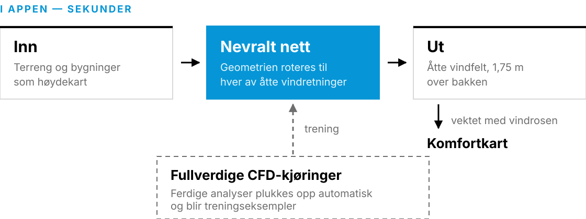
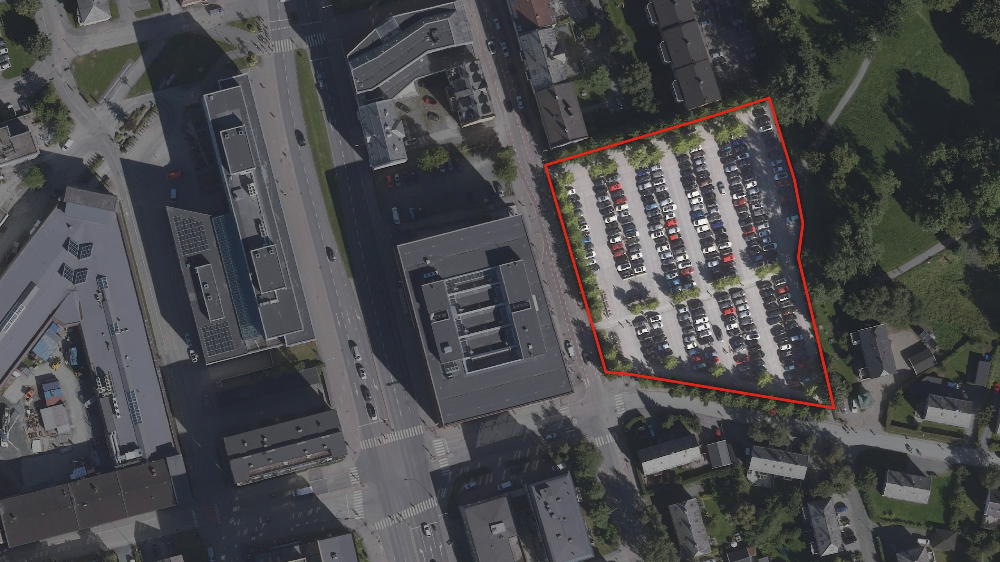

# Jenter i AI

> _Kort pitch for foredraget her._

Foredrag for **Jenter i AI**. Slides på norsk.

## Kjøre slidene

Ingen byggesteg — `talk/slides.md` redigeres direkte.

> **Kjør fra `talk/`, ikke fra rota.** Både `--theme theme.css` og katalogen som
> serveres (`.`) tolkes relativt til der du står. Står du i rota finner ikke Marp
> `theme.css`, og slidene rendres med standardtemaet — de blir stygge, men det er
> ingen feilmelding som forteller deg det.

```bash
cd talk

# Watch mode (live reload på http://localhost:8080/slides.md)
docker run --rm --init -v "$PWD":/home/marp/app -e LANG=$LANG -p 8080:8080 -p 37717:37717 \
  marpteam/marp-cli:v3.2.0 \
  --theme theme.css --watch -s --html=true .
```

Hver linje slutter med backslash `\` — det må være **siste tegn på linja** (ingen
mellomrom etter), ellers splitter zsh kommandoen og du får feil som
`flag needs an argument: 'e'`.

Åpne <http://localhost:8080/slides.md>. Stopp serveren med `Ctrl-C`.

Vil du heller kjøre uten å bytte katalog, pek mountet rett på `talk/`:

```bash
docker run --rm --init -v "$PWD/talk":/home/marp/app -e LANG=$LANG -p 8080:8080 -p 37717:37717 \
  marpteam/marp-cli:v3.2.0 \
  --theme theme.css --watch -s --html=true .
```

Har du `marp` installert lokalt, får du Artifakt i stedet for Inter:

```bash
cd talk && marp --theme theme.css --html -w slides.md
```

### Feilsøking

| Symptom | Årsak |
| --- | --- |
| Slidene har hvit bakgrunn og serif-tekst, ingen logo | Temaet ble ikke funnet — du kjørte fra rota i stedet for `talk/` |
| `Bind for 0.0.0.0:8080 failed: port is already allocated` | En gammel container kjører. `docker ps`, så `docker stop <navn>` |
| Endringer i `slides.md` slår ikke gjennom | Watch-modus følger bare den monterte katalogen — sjekk at mountet peker på `talk/` |

Sjekk hva som faktisk serveres:

```bash
curl -s http://localhost:8080/slides.md | grep -c 0696D7   # 1 = temaet er med, 0 = ikke
```

### Figurer

Én mappe per del av foredraget. Det gamle `illustrations/`-nivået er borte —
stiene var lange og alt lå i samme haug.

| Mappe | Hva |
| --- | --- |
| `figures/tidligfase/` | Flyfotoet av Hesthagen + arkitekt- og utbyggerfigurene (slide 3–5) |
| `figures/site-design/` | Skjermbilder fra Forma, ett per steg (slide 7–11) |
| `figures/analyser/` | De seks analyse-ikonene |
| `figures/vind/` | Gløshaugen-renderingene: komfortkartet og strømlinjene |
| `figures/modeller/` | Fysikkmodell og surrogat: ikoner, pipeline-tegning, nettverksplott |
| `figures/hesthagen/` | Kartverket-kartet over tomta, med og uten ring |
| `figures/people/` | Portretter |
| `figures/logos/` | Autodesk-merket som SVG, svart og hvit. Begge public domain fra Wikimedia, kilde og lisens i toppen av filene |
| `figures/video/` | Demofilmens klippelister og de 15 iterasjonsrutene |

Figurene er ikke lenger nummerert etter rekkefølge i decket. Mappa sier hvor
figuren hører hjemme, og da blir nummeret bare noe som må stelles hver gang en
slide flyttes.

```markdown

```

eller, for å styre størrelsen:

```html

```

#### Oppløsningskravet: 2x av det figuren vises i

Decket framføres på storskjerm, og slideflata er 1280x720 CSS-piksler. Regelen
er derfor **minst 2x av visningsstørrelsen** — altså 2560x1440 for et bilde som
fyller flata, og tilsvarende for et som ligger i en spalte. Under det blir
kantene myke på en projektor, selv om det ser greit ut på en laptop.

Alle rasterfilene er gjennomgått. Her er faktorene, regnet ut fra hva CSS-en
faktisk viser dem i:

| Figur | Fil | Vist | Faktor |
| --- | --- | --- | --- |
| `site-design/*.png` | 2560x~1427 | fullflate | **2,0x** |
| `tidligfase/hesthagen-flyfoto*.jpg` | 2560x1440 | fullflate | **2,0x** |
| `vind/gløshaugen-streamlines.png` | 3205x1785 | fullflate (tittelsliden) | **2,5x** |
| `modeller/surrogatmodell.png` | 2090x1274 | ~971x592 | **2,2x** |
| `vind/streamlines.png` | 2582x1640 | ~630x400 | **4,1x** |
| `vind/windcomfortgløs.png` | 2744x2132 | ~618x480 | **4,4x** |
| `vind/gløshaugen-komfor-plot.png` | 2460x1606 | ~483x315 | **5,1x** |
| `vind/vindrose.png` | 1156x1652 | ~225x322 | **5,1x** |
| `analyser/*.png` | 1930–2648 bred | ~363 bred | **5,3–7,3x** |
| `modeller/predictions/*.png` | 670–1441 | 176–292 | **3,8–4,9x** |
| `people/*.jpg` | 1950–4032 | maks 345 | **6,7–12x** |
| `video/iterations/*.jpg` | 3200x2134 | ~236x157 | **13x** |
| `hesthagen/hesthagen-kart-ring.png` | 1000x625 | ~558x349 | **1,79x** ⚠️ |

**Det ene unntaket** er kartet med ring, og det står på en baklomma-slide som
ikke er med i de 15 minuttene. Det kan ikke fikses fra det som ligger i repoet:
kildefila `hesthagen-kart.png` er selv bare 1200x900, og utsnittet bruker
allerede 1000 av de 1200 pikslene. Skal det opp, må kartet hentes på nytt fra
Kartverkets WMS i dobbel oppløsning — `tools/hesthagen_geo.py` kan gjøre det
(`Frame(w, h, mpp, …)` er fritt valgbar) — men innrammingen til dagens fil er
ikke skrevet ned noe sted, så `CROP`- og ringkoordinatene under «Kartet med
ring» må måles opp på nytt samtidig.

To filer er slettet i samme gjennomgang fordi de var for små OG erstattet av noe
bedre: `people/sunniva.png` (255x255, vist 240 px — byttet til
`sunniva-color.jpg` på 2906x2906) og `video/stills/logo.jpg` (1920x1080 på
fullflate — erstattet av `.forma-lockup`, som er vektor).

#### Tidligfase-bildet (slide 3–5)

Slidene «Alt er åpent, ingenting er tegnet», arkitekten og utbyggeren deler ett
bakgrunnsbilde: `figures/tidligfase/hesthagen-flyfoto.jpg`. Det
er Hesthagen-parkeringen, ikke Filipstad — samme tomt som case-sliden senere i
decket, så publikum kjenner igjen stedet når det kommer tilbake.

Bildet lages av `tools/hesthagen_slide4.py`: flyfoto fra 2022, siste årgang før
anlegget startet, med alt utenfor tomta dempet. Blikket havner på tomta uten at
noe må peke, og bilene leses — planen har ingenting tegnet der, virkeligheten er
full av parkerte biler.

**Flyfoto-varianten har sin egen ramme.** `ROLLER` i skriptet legger tomta til
høyre og litt opp, i stedet for midt i flata som de andre variantene. Grunnen er
slide 4 og 5: rollefigurene skal ikke dekke den røde streken, så venstre halvdel
må være ledig. Utsnittet er også videre (0,135 mot 0,113 m/px) for at tomta skal
bli mindre i flata. Ortofotoet er ca. 0,10 m/px, så vi nedskalerer fortsatt
kilden — vi mister utsnitt, ikke skarphet.

Tomta havner da på x 698–1068 og y 125–523 i slide-piksler. `.roles-holder
.venstre` i temaet stopper på x=624, altså 75 px klaring. Endrer du ramma, må
det tallet sjekkes på nytt — skriptet skriver ut hvor tomta lander.

```bash
python3 tools/hesthagen_slide4.py              # alle fem variantene
python3 tools/hesthagen_slide4.py flyfoto      # bare den som er i bruk
```

| Variant | Hva det er |
| --- | --- |
| `flyfoto` | **I bruk.** Bare flyfoto, tomta ringet inn og resten dempet. Egen ramme, se under |
| `kart-foto` | Kart til venstre, foto til høyre, overgang til venstre for tomta |
| `kart-foto-bred` | Som `kart-foto`, men overgangen går tvers over tomta |
| `innfelling` | Flyfoto med gråtonekartet som innfelt kort oppe til høyre |
| `blankt` | Tomta fylt med flatt kartgrått — «ingenting er tegnet» bokstavelig |

Figurene på slide 4 og 5 er de **lyse** utgavene, `rolle-arkitekt-lys.svg` og
`rolle-utbygger-lys.svg`. De mørkegrå originalene (`#3D3D3D`) forsvant mot
trekroner og asfalt — på et foto er mørkt mot mørkt. Nesten hvit kropp med mørk
kontur leses overalt. Hatten beholder fargen, så rollene er til å kjenne igjen.
Navnet står under figuren, i hvitt med mørk skygge, fordi det ligger på fotoet
og ikke på den lyse kroppen.

**Spørsmålene sto i snakkebobler før.** To bobler à to kulepunkter tok nesten
halve sliden og tvang figurene ned i 140 px. Nå er figurene 440 px, sliden er
uten tekst bortsett fra rollenavnene, og spørsmålene sies muntlig — de står i
Say-notatene i `slides.md`. Skal de tilbake på flata, står oppskriften i
`theme.css` over `section.overlay .bubble`, og figurhøyden må ned igjen.

Bytter du variant, må filnavnet endres på **alle tre** slidene. Bildet skal ikke
skifte mens rollene kommer inn; det er oppbyggingen som er poenget.

Tre ting er verdt å vite før du endrer skriptet:

- **Årgangen er ikke tilfeldig.** 2022 er siste ortofoto før anlegget startet, og
  det eneste som viser plassen full av biler. Nyere årganger viser byggegrop, og
  en byggegrop sier «noen har alt bestemt seg» — stikk motsatt av sliden.
- **Komposisjonen er styrt av det som ligger oppå.** For flyfoto-varianten er
  det `ROLLER` som gjelder, ikke `FX`/`FY`: tomta til høyre, figurene til
  venstre. For de andre variantene står tomta midt i flata, og de er bare
  aktuelle om du går tilbake til et oppsett der innholdet ligger nederst over
  hele bredden — da dekker det nedre to tredjedeler, og tomta må ligge høyt.
- **Tomtegrensa er data, ikke frihånd.** Polygonet ligger i
  `tools/hesthagen_geo.py` og er hentet fra OpenStreetMap (`way/35838067`,
  `landuse=construction`, navn «Hesthagen», 7095 m²) med Overpass:

  ```bash
  curl -s https://overpass-api.de/api/interpreter --data-urlencode \
    'data=[out:json];way(35838067);out geom;'
  ```

Lagene hentes fra WMS og ikke fra flisetjenester, med vilje — det gjelder både
ortofotoet og gråtonekartet, selv om flyfoto-varianten bare bruker det første:
fliser låser
oppløsningen til zoomtrinnene — Kartverkets fliser stopper på 0,27 m/px her —
mens en WMS tegner det utsnittet du ber om i den pikselstørrelsen du ber om.
Derfor er bildene 2560x1440 px: 0,113 m/px for variantene med den felles ramma
og 0,135 for flyfoto med `ROLLER`. Begge er grovere enn ortofotoets egne ca.
0,10 m/px, så kilden nedskaleres og ingenting oppskaleres. Alt regnes i EUREF89 UTM32N, som er det eneste koordinatsystemet
begge tjenestene deler, og det er derfor kart og foto ligger pikselnøyaktig oppå
hverandre.

#### Kartet med ring

`hesthagen-kart-ring.png` er et utsnitt rundt tomta med en rød ring rundt
parkeringsplassen. **Kildefila `hesthagen-kart.png` er slettet** — den var 602 kB
som ingen slide viste, og den var likevel for lavoppløst (se
«Oppløsningskravet»), så skal ringen flyttes, må kartet hentes på nytt fra
Kartverkets WMS uansett. Skriptet under står igjen som oppskrift på hva som skal
skje etterpå.

Ringen er **brent inn i fila**, ikke lagt på i CSS eller SVG — Marp rendrer hver slide inne i sin egen `<svg>`, og en nøstet
inline-SVG med en ekstern `<image>` kom ikke opp i eksporten. En bakt PNG rendrer
likt i watch-modus, HTML og PDF.

`CROP` er utsnittet (behold forholdet 1,6:1, ellers endres høyden på sliden),
`CX/CY/RX/RY` er ringen — alt i kildefilas pikselkoordinater. Tallene gjaldt den
slettede 1200x900-fila, så de må måles opp på nytt mot kartet du henter:

```python
from PIL import Image, ImageDraw

SRC = 'figures/hesthagen/hesthagen-kart.png'
OUT = 'figures/hesthagen/hesthagen-kart-ring.png'
CROP = (100, 190, 1100, 815)          # 1000x625 = 1,6:1
CX, CY, RX, RY = 572, 500, 142, 138   # midt på parkeringsplassen
RED, W, SS = (225, 37, 27, 255), 8, 4 # SS = supersampling, PIL tegner uten antialias

base = Image.open(SRC).convert('RGBA').crop(CROP)
w, h = base.size
ov = Image.new('RGBA', (w * SS, h * SS), (0, 0, 0, 0))
cx, cy = (CX - CROP[0]) * SS, (CY - CROP[1]) * SS
ImageDraw.Draw(ov).ellipse(
    [cx - RX * SS, cy - RY * SS, cx + RX * SS, cy + RY * SS],
    outline=RED, width=W * SS)
base.alpha_composite(ov.resize((w, h), Image.LANCZOS))
base.convert('RGB').save(OUT)
```

CC BY tillater derivater så lenge attribusjonen følger med — den står i
bildeteksten på sliden.

For animerte SVG-er med SMIL (`<animate>` / `<animateMotion>`), bruk `<object>`
i stedet for `` — da kjører nettleseren dem som et levende dokument:

```html
<object data="figures/modeller/surrogat-pipeline.svg" type="image/svg+xml" width="90%"></object>
```

Interaktive widgets som trenger CSS-søskenselektorer må ligge inline i sliden —
de kan ikke flyttes ut, fordi CSS-en bor utenfor SVG-en.

### Eksportere til fil

Hver linje slutter med backslash `\` — det må være **siste tegn på linja** (ingen
mellomrom etter), ellers splitter zsh kommandoen og du får feil som
`flag needs an argument: 'e'`.

Frittstående HTML:

```bash
docker run --rm -v "$PWD":/home/marp/app/ -e MARP_USER="$(id -u):$(id -g)" -e LANG=$LANG \
    marpteam/marp-cli:v3.2.0 \
    --theme theme.css --allow-local-files --html slides.md -o slides.html
```

PDF:

```bash
docker run --rm -v "$PWD":/home/marp/app/ -e MARP_USER="$(id -u):$(id -g)" -e LANG=$LANG \
    marpteam/marp-cli:v3.2.0 \
    --theme theme.css --allow-local-files --html slides.md --pdf
```

## Ett deck, to filformater

Decket hadde **to utgaver** før: en YouTube-embed av demofilmen i HTML-en, og en
serie stillbilder i PDF-en — fordi ingen PDF-viser utenom Adobe Acrobat på
desktop kan spille av video. (Standarden har det, Rich Media-annotasjoner, men
Preview, Chrome, Firefox og alt på mobil viser bare et stillbilde.) Det krevde en
generert mellomfil og et skript som byttet slidene om, og PDF-en og nettsiden
viste dermed ikke det samme.

**Videoen er tatt ut.** Skjermbildene rett fra Forma (`figures/site-design/`)
gjør jobben i begge formater — de er dessuten 2560 px mot filmens 1920, og de
viser Hesthagen i stedet for Filipstad. `slides.md` er nå den eneste kilden:

| Fil | Hva |
|---|---|
| `talk/slides.md` | **kilden.** Redigér her — det er ikke noe byggesteg over denne |
| `talk/slides.pdf` | PDF-en du framfører fra og deler |
| `talk/index.html` | nettutgaven som publiseres på GitHub Pages |

Borte med videoen: `talk/_filmslide.md`, den genererte `talk/slides-film.md`,
`tools/inject_film.py`, klippelistene `forma-demo.shots` og `forma-demo.stills`,
og reglene for `<video>`, `<iframe>` og `.demo-intro` i `theme.css`.

### Bygge

Ingen preprosessering, ingen mellomfiler og ingen skript — begge formater kommer
rett fra `slides.md` med én kommando hver. Kjør fra `talk/`:

```bash
cd talk

# PDF
docker run --rm -v "$PWD":/home/marp/app -e MARP_USER="$(id -u):$(id -g)" -e LANG=C.UTF-8 \
  marpteam/marp-cli:v3.2.0 \
  --theme theme.css --allow-local-files --html slides.md --pdf -o slides.pdf

# HTML
docker run --rm -v "$PWD":/home/marp/app -e MARP_USER="$(id -u):$(id -g)" -e LANG=C.UTF-8 \
  marpteam/marp-cli:v3.2.0 \
  --theme theme.css --allow-local-files --html slides.md -o index.html
```

Det er ordrett de samme to kommandoene `publiser-slides.yml` kjører, så du får
det CI får. Bygget gjør ingen nettkall; se «Matte uten nett».

### Slides med tekst oppå et bilde

Klassen `overlay` (sammen med `demo`) gir bildet full flate og legger teksten
oppå på en lys plate:

```markdown
<!-- _class: demo overlay -->



<div class="overlay-label">
  <div class="kicker">Tidligfase</div>
  <h1>Kunsten å fylle opp en tomt</h1>
</div>
```

Platen er ikke pynt. Forma-grensesnittet er lyst, og hvit tekst rett på bildet
forsvinner på omtrent halvparten av dem — men hvit plate forsvant også, der
bakgrunnen selv er hvit. Derfor lys grå (`#E6EAEE` på 92 %) med mørk tekst, som
leses både mot nattblå globus og mot lyst sidepanel.

Beslektede klasser:

| Klasse | Hva den gjør |
|---|---|
| `flipbook` | fullflate-bilde med `.demo-label` nede til venstre, som Site Design-stegene |
| `eget-merke` | skjuler vår egen Autodesk-logo — brukes når bildet alt har Formas merke i seg |
| `on-dark` | gjør logo og sidetall hvite, for bilder som er mørke nede til venstre |
| `logo-card` | skjuler vår egen logo fordi sliden ER et logokort (slide 6) |

### Hente ruter ut av et skjermopptak

Det er sånn `figures/video/iterations/` ble laget — 15 ruter fra ett opptak av
Hesthagen-modellen, samme kamera hele veien. Rutene er sjekket inn, så dette
trengs bare hvis du skal lage serien på nytt. Legg opptaket i
`talk/figures/video/` (gitignorert, for stort for git) og kjør ffmpeg i Docker:

```bash
# 15 ruter jevnt fordelt over opptaket
docker run --rm -e PUID=$(id -u) -e PGID=$(id -g) \
  -v "$PWD/talk/figures/video:/in:ro" -v "$PWD/talk/figures/video/iterations:/out" \
  linuxserver/ffmpeg -nostdin -v error -i /in/opptak.mov \
  -vf "fps=15/$(ffprobe -v error -show_entries format=duration -of csv=p=0 talk/figures/video/opptak.mov)" \
  -q:v 3 /out/hesthagen-%03d.jpg

# Kontaktark for å se hva som finnes hvor. Hver rute er 2 sekunder, radvis fra 0
docker run --rm -e PUID=$(id -u) -e PGID=$(id -g) \
  -v "$PWD/talk/figures/video:/in:ro" -v /tmp/contact:/out \
  linuxserver/ffmpeg -nostdin -v error -i /in/opptak.mov \
  -vf "fps=0.5,scale=480:270,tile=5x5" -q:v 3 /out/sheet-%02d.jpg
```

Ta bare ruter der komfortkartet står ferdig tegnet (grønt/gult) — hopp over de
blå mens den regner, og de der en bygning er valgt. Det er derfor de 15 ble
plukket for hånd fra et kontaktark og ikke bare tatt jevnt fordelt.

### Skjermbilder rett fra Forma

macOS har verktøyet innebygd:

```bash
screencapture -w talk/figures/site-design/nytt-steg.png   # klikk på vinduet
screencapture -s talk/figures/site-design/nytt-steg.png   # dra ut et utsnitt
```

**Forberedelsene er det som betyr noe:**

1. Slå på fullskjerm i nettleseren (Cmd-Ctrl-F). Da forsvinner fanerad og
   adressefelt, og bildet blir 16:9 uten at noe må beskjæres bort etterpå.
2. Skjul panelene du ikke vil ha med. Bildet som sto på tidligfase-sliden før
   viste hele grensesnittet — det leste som programvare på en slide som skulle
   si «tomt».
3. Sjekk oppløsningen etterpå: `sips -g pixelWidth -g pixelHeight fila.png`.
   Ett skjermbilde på en Retina-skjerm er 2x av det du ser, altså 2560–3840 px
   bredt, og det er godt over kravet i «Oppløsningskravet» over.

Terminalen må ha skjermopptakstilgang (Systeminnstillinger → Personvern og
sikkerhet → Skjermopptak), og programmet må startes på nytt etterpå. Det er
også grunnen til at en agent ikke kan gjøre dette for deg: tilgangen henger på
appen som ber om den, og må gis av et menneske. `screencapture` svarer
`could not create image from display` uten den.

### Hente video ut av en PowerPoint

Fortsatt nyttig hvis du får tilsendt et deck med et opptak i. En `.pptx` er et
zip-arkiv, og innebygde videoer ligger urørt i `ppt/media/`:

```bash
unzip -l deck.pptx | grep -iE 'ppt/media/.*\.(mp4|mov|m4v|webm)'
unzip -j deck.pptx "ppt/media/media1.mp4" -d talk/figures/video/
```

Er videoen *lenket* i stedet for innebygd, ligger den ikke der — da står stien i
`ppt/slides/_rels/slideN.xml.rels`.

## Publisering

`.github/workflows/publiser-slides.yml` bygger decket ved hver push til `main`
og legger resultatet på `gh-pages`-branchen, som GitHub Pages serverer:

- `index.html` — decket
- `slides.pdf` — samme deck som PDF
- `figures/`, `fonts/` — kopiert med, siden temaet peker på dem relativt

Workflowen kjører også på pull requests, men publiserer ikke da — den laster i
stedet opp resultatet som en artefakt du kan laste ned fra kjøringen. Det gjør
at en ødelagt slide fanges opp før den treffer `main`.

Byggingen bruker samme Docker-image og versjon som README-en over
(`marpteam/marp-cli:v3.2.0`), med `talk/` montert som arbeidsmappe. Da blir CI og
maskinen din identiske.

### Engangsoppsett

Pages må slås på én gang, etter at workflowen har kjørt første gang og laget
`gh-pages`:

**Settings → Pages → Source: Deploy from a branch → `gh-pages` / `(root)`**

eller fra terminalen:

```bash
gh api -X POST repos/sunniva-indrehus-adsk/jenter-i-ai/pages \
  -f 'source[branch]=gh-pages' -f 'source[path]=/'
```

Decket ligger så på `https://sunniva-indrehus-adsk.github.io/jenter-i-ai/`.

## Autodesk-profil

Temaet (`talk/theme.css`) etterligner Autodesks visuelle profil:

| Element | Valg |
| --- | --- |
| Typografi | **Inter** (åpen) — eller **Artifakt** hvis du har den installert |
| Farger | Autodesk-svart `#000000` på hvit `#FFFFFF`, grå `#6E6E6E` til sekundærtekst |
| Overskrifter | **Svarte**, med blå strek under `h1`. Tittelteksten var blå før, men når også den største skriften på hver slide er blå, er blått ikke lenger en aksent — se kommentaren over `h1` i `theme.css` |
| Aksent | Autodesk-blå `#0696D7` — streken under `h1`, kulepunkter, lenker, `.kicker`, `.callout`, markeringen av vindkortet |
| Oransje | `#F5871F` — **kun** `.todo`-lappene, ikke en merkevarefarge |
| Logo | Hvit lockup øverst til venstre på tittel- og `section`-slidene, svart nede til venstre ellers |
| Sidetall | Nede til høyre, grått |

Alt er sjekket inn, så en fersk klone rendrer identisk. **Ingenting hentes fra
nett under bygging** — heller ikke KaTeX-fontene, som Marp ellers henter fra en
CDN. Se «Matte uten nett» for hvordan det er sikret og hvordan du sjekker at det
fortsatt holder.

### Logo

`talk/figures/logos/autodesk-logo-black.svg` og `-white.svg` er
[Autodesks primærlogo fra 2021][logo], hentet fra Wikimedia Commons. Filen er
**public domain** der — den består bare av enkle geometriske former og tekst, og
kommer ikke over terskelen for verkshøyde. Den hvite varianten er samme fil med
`fill` byttet til `#FFFFFF`; kilde og lisens står som kommentar i begge filene.

Navnet og logoen er fortsatt et registrert varemerke til Autodesk. Her brukes de
til å vise hvor foredragsholderne jobber, som er vanlig, beskrivende bruk.

[logo]: https://commons.wikimedia.org/wiki/File:Autodesk_Logo_2021.svg

### Skrifter

Autodesks merkevareskrift er **Artifakt**, men den er lisensiert og kan ikke
sjekkes inn. Temaet løser det med en to-trinns stakk:

1. `'Artifakt Element'` / `'Artifakt Legend'` — treffer hvis du har skriften
   installert lokalt (den ligger i `/Library/Fonts` på en Autodesk-Mac).
2. `'Inter'` — pakket med i `talk/fonts/Inter-latin.woff2` (48 kB, variabel
   vekt 100–900) under [SIL Open Font License 1.1][ofl]. Lisensteksten ligger i
   `talk/fonts/Inter-OFL.txt`, som OFL krever.

Inter er en nær nok neo-grotesk til at decket ser likt ut uansett hvilken av de
to som slår til. Docker-eksport bruker Inter, siden containeren ikke ser
systemfontene dine.

[ofl]: https://openfontlicense.org/

### Matte uten nett

**Ligningene krevde internett før.** Marp Core injiserer KaTeXs egen CSS, og den
peker `@font-face` mot `cdn.jsdelivr.net`. Uten nett falt matten tilbake til en
systemserif, og da forsvant operatorene — punkttegnet i `(U·∇)U` og
transponerings-T-en ble **borte**, ikke bare stygge. Det er lett å ikke oppdage,
fordi bygget går fint og alt annet på sliden ser riktig ut.

Fikset på samme måte som Inter: fontene ligger i `talk/fonts/katex/` og temaet
deklarerer dem lokalt. Overstyringen virker fordi Marp legger temaet **etter**
KaTeX-CSS-en, og en senere `@font-face` med samme familie/vekt/stil erstatter
den forrige. Lisens: MIT, `talk/fonts/katex/KaTeX-MIT.txt`.

**Bare de fire ligningen faktisk bruker er sjekket inn** — `Main-Regular`,
`Main-Bold`, `Math-Italic`, `Size1-Regular`, til sammen 73 kB. KaTeX har 20
familier, men de 16 andre er 182 kB for symboler decket ikke har.

Konsekvensen er verdt å forstå: for de 16 står Marps egne CDN-regler urørt, så de
virker **med** nett og faller til serif **uten**. Legger du inn et symbol fra
AMS, en større brøk (`Size2`–`Size4`), `\mathscr`, `\mathfrak` eller `\texttt`,
må fonten lastes ned til `talk/fonts/katex/` og en `@font-face` legges til i
`theme.css` — ellers ser ligningen riktig ut på maskinen din og feil i PDF-en fra
et bygg uten nett.

**Sjekk at det fortsatt holder** — bygg med nettet avslått og sammenlign:

```bash
cd talk
docker run --rm --network none -v "$PWD":/home/marp/app \
  -e MARP_USER="$(id -u):$(id -g)" -e LANG=C.UTF-8 \
  marpteam/marp-cli:v3.2.0 \
  --theme theme.css --allow-local-files --html slides.md --pdf -o _offline.pdf
```

Skal gi 36 sider som er **pikselidentiske** med et nettbygg. Slik ble det
verifisert:

```bash
pdftoppm -r 50 -png _offline.pdf /tmp/off
pdftoppm -r 50 -png slides.pdf   /tmp/on
# sammenlign /tmp/on-NN.png mot /tmp/off-NN.png — 0 ulike piksler på alle 36
```

Rask indikasjon uten å rastrere: PDF-en skal ha KaTeX-fonter innebygd.

```bash
python3 -c "
from pypdf import PdfReader
f={str(p['/Resources']['/Font'][k]['/BaseFont']).split('+')[-1]
   for p in PdfReader('_offline.pdf').pages
   for k in (p.get('/Resources',{}).get('/Font') or {})}
print(sorted(x for x in f if 'KaTeX' in x))"
# ['KaTeX_Main-Bold', 'KaTeX_Main-Regular', 'KaTeX_Math-Italic', 'KaTeX_Size1-Regular']
# Tom liste = fontene ble ikke funnet, og matten er falt tilbake til serif.
```

**Oppgraderer du `marp-cli`, må blokka hentes ut på nytt**, siden KaTeX-versjonen
og dermed deskriptorene kan endre seg. Bygg HTML-en én gang med nett, og generer
`@font-face`-reglene fra KaTeXs egne regler i resultatet:

```bash
cd talk
python3 - <<'PY'
import re
html = open('index.html').read()
for r in re.findall(r'@font-face\{[^}]*KaTeX[^}]*\}', html):
    fam = re.search(r'font-family:([^;}]+)', r).group(1).strip()
    sty = re.search(r'font-style:([^;}]+)', r)
    wgt = re.search(r'font-weight:([^;}]+)', r)
    w2  = re.search(r"url\(\s*['\"]?([^)'\"]*\.woff2)['\"]?\s*\)", r)
    base = w2.group(1).rsplit('/', 1)[-1]
    print(f"@font-face {{\n  font-family: {fam};")
    if sty: print(f"  font-style: {sty.group(1).strip()};")
    if wgt: print(f"  font-weight: {wgt.group(1).strip()};")
    print(f"  src: url('fonts/katex/{base}') format('woff2');\n}}")
PY
```

Last ned de nye `.woff2`-ene fra samme CDN-URL-er og bytt blokka i `theme.css`.

> Portrettene i `talk/figures/people/` blir offentlige når repoet publiseres.
> Sjekk at alle avbildede er med på det.

## Slidetyper

| Klasse | Bruk |
| --- | --- |
| `<!-- _class: title -->` | Tittel- og avslutningsslide — svart bakgrunn, hvit lockup. `#` tittel, `##` undertittel, `###` arrangement (settes i versaler) |
| `<!-- _class: title title-photo -->` | Som over, men lys: full-bleed render i bakgrunnen og svart tekst |
| `<!-- _class: section -->` | Kapittelskille — svart, venstrejustert `#` + `##` |
| `<!-- _class: statement -->` | Én stor påstand midt på hvit bakgrunn |
| _(ingen)_ | Vanlig innholdsslide — overskrift med strek under, innhold under |

### Tittelslide med bilde

`title-photo` legger en render i full bredde bak tittelen. Bildet er lyst, så
sliden snus fra svart til hvit og teksten settes i svart. **To myke hvite sjikt**
ligger over renderingen, ett i hvert nedre hjørne, og begge er der for å gjøre
noe leselig:

| Sjikt | Hva det bærer |
| --- | --- |
| nedre venstre, `78% 62% at 2% 104%` | holdt tittelteksten leselig. Tittelen står ikke skrevet lenger, så det leses nå som en myk vignett |
| nedre høyre, `64% 56% at 98% 104%` | bærer arrangementslogoen |

**Tittelsliden har ingen tittel skrevet på seg nå.** Arrangementets egen logo
står nede til høyre i stedet, og den SIER «Jenter i AI» — en `h1` med samme
ordene under den var det samme to ganger. Temaet styler `h1` fortsatt, så legger
du «# Jenter i AI» tilbake, lander den nede til venstre som før.

Logoen ligger **rett på renderingen, uten plate** — det er den beste visuelle
effekten, men den krever det høyre sjiktet. Hovedbygningens høyre kant er en
hard, rett vertikal strek på x=1152 av 1280, og bygget dekker alt til venstre for
den og over y=585. En logo nede til høyre som er stor nok til å leses, får derfor
streken tvers gjennom seg — rendret og sett: den delte logoen i to og stakk rett
gjennom håret på tredje figur. Håret er problemet i seg selv, for i logofila er
det tegnet **uten fyll** (den er laget for hvit bakgrunn), så alt bak skinner
gjennom.

En hvit plate med hårstrek ble prøvd først og virket, men leste som en
klistrelapp oppå bildet i stedet for som en del av det. Sjiktet gir samme
lesbarhet uten kant. `64% 56%` og ikke `52% 46%`: begge ble rendret og
sammenlignet i utsnitt, og den smalere lot bygningskanten skimte gjennom bak
tredje figur.

`background-image` er **én** egenskap med en liste av lag, så et sjikt kan ikke
legges til fra en `<style scoped>` uten å gjenta hele stakken. Derfor bor begge
i `theme.css` ved `section.title-photo`. Legger du til et lag, må
`background-size`/`-position`/`-repeat` få ett komma mer hver, og gradientene må
stå **før** `var(--photo)` — ellers ligger fotoet øverst og sjiktene gjør
ingenting.

**«Building geometries by Geodata AS» er malt ut av `gløshaugen-streamlines.png`.**
Forma brente krediteringen inn nede til høyre, nøyaktig der logoen nå står. Flata
der var ensfarget (195,206,215), så lappen er usynlig — samme grep som da
«Autodesk Forma»-lockupen ble malt ut av samme fil. Krediteringen er flyttet til
kildetabellen under «Kilder og rettigheter»; den er ikke borte.

Standardbildet er `gløshaugen-streamlines.png`. Bytt det per slide:

```markdown
<!-- _class: title title-photo -->

<style scoped>
section { --photo: url('figures/vind/en-annen-render.png'); }
</style>
```

Renderen fra Forma har allerede en «Autodesk Forma»-lockup øverst til venstre,
så temaets egen logo er skrudd av på denne slidetypen — ellers hadde det blitt
to logoer.

## Byggeklosser

```html
<div class="cols-2"> … </div>     <!-- to like spalter -->
<div class="cols-3"> … </div>     <!-- tre kort på rad, lik høyde -->
<div class="card"><h3>…</h3><p>…</p></div>
<div class="callout"> … </div>    <!-- blå ramme til venstre -->
<div class="kicker">Stikkord</div>
<div class="person">             <!-- tekst venstre, stort portrett høyre -->
  <div>… kulepunkter …</div>
  <div class="person-photo">
    <div class="frame"></div>
    <span>Sunniva</span>
  </div>
</div>
<div class="who-row">            <!-- flere små portretter på rad -->
  <div class="who"><span>Sunniva</span></div>
</div>
<div class="figcap"><span class="figref">Figur 1</span> Bildetekst.</div>
<div class="todo">Ting som mangler</div>  <!-- oransje lapp, se under -->
```

### AUTODESK FORMA-lockupen

Produkt-lockupen er **bygd, ikke et bilde** — Autodesk-merket fra den
PD-lisensierte SVG-en pluss produktnavnet som levende tekst:

```html
<style scoped>
.forma-lockup { --lw: 620px; }   <!-- bredden, og det eneste tallet du endrer -->
</style>

<div class="forma-lockup">
  
  <div class="produkt">Forma</div>
</div>
```

Alle proporsjoner regnes ut fra `--lw`, så den kan skaleres fritt. Brukt på
logokortet, slide 6. (Den sto også på tittelkortet over demovideoen, men både
videoen og kortet er borte — se «Ett deck, to filformater».)

Grunnen til at den er bygd: det finnes **ingen offentlig SVG** av lockupen
«Autodesk Forma» — søker du den opp, får du Autodesks ordinære firmalogo. Og en
SVG med tekst i seg hjelper ikke, for en SVG lastet via `` rendres i sitt
eget dokument og når ikke `@font-face`-en i temaet; «Forma» ville falt tilbake
til en systemskrift. Vektor pluss levende tekst er skarpt i alle oppløsninger og
bruker deckets egen skrift.

**Rettighetene:** merket er `autodesk-logo-white.svg`, Autodesks primærlogo fra
2021, hentet fra Wikimedia Commons som public domain (PD-textlogo) — kilde og
lisens står i toppen av SVG-fila. «Forma» er levende tekst i Inter (SIL OFL) og
ikke en bildefil. Det er altså **ingen nedlastet produktlogo** her, og ingenting
fra en vektorlogo-side med uklar opphavsrett. Autodesk-navnet og -logoen er
registrerte varemerker; å sette produktnavnet i en nøytral skrift er beskrivende
bruk, på samme grunnlag som avsnittet «Logo» over beskriver for firmalogoen.

Rasterfila `figures/logos/autodesk-forma-logo.png` er **slettet**. Den lå i
repoet fra før, hadde ingen dokumentert kilde eller lisens, og
`publiser-slides.yml` kopierer hele `talk/figures/` til den offentlige
gh-pages-siden. Målene den ble brukt til står nå i kommentaren over
`.forma-lockup` i `theme.css`, sammen med ettermålingen på en rendring.

### TODO-lapper

Ting som skal fikses før du går på scenen, som en oransje lapp nede til venstre —
rett til høyre for logoen, på samme plass som `footer` har i temaet:

```html
<div class="todo">Sett inn faktiske tall</div>
```

Flere på samme slide: skill dem med `<br>` inni **samme** div. Lappen er ankret i
bunnen og vokser oppover. To `.todo`-divs på én slide legger seg oppå hverandre.

Lappen er absolutt posisjonert, så den skyver aldri innhold rundt — den kan
ligge hvor som helst i slidens markup, og en slide som var trang før blir ikke
trangere. Den er også med i PDF-eksporten, som er poenget: da ser du restene når
du blar gjennom decket.

**Skjul alle før presentasjon** ved å sette én verdi i `theme.css`:

```css
:root { --todo-display: none; }   /* block når du redigerer videre */
```

Rekk over alt som står igjen:

```bash
grep -n 'class="todo"' talk/slides.md
```

`<!-- TODO ~M:SS -->`-kommentarene er noe annet: de er tidsbudsjett per slide,
ikke ting som skal endres, og de skal ikke vises.

### Person-slides

`.person` er et rutenett med tekst til venstre og étt stort portrett til
høyre. Portrettet ligger i `.person-photo > .frame`, som klipper det til en
sirkel på 250 px.

`.frame` finnes fordi portrettene er av ulik type: noen er fotografier som
fyller hele flaten, andre utklipp på hvit studiobakgrunn. Ringen rundt gir
sirkelen en definert kant også mot hvit slide, og en liten `scale(1.05)` kutter
bort kanter som måtte være bakt inn i bildefila.

Portrettene bør være kvadratiske og minst 500×500 px — de vises på 250 px, så
mindre filer blir synlig uskarpe på projektor.

## Konvensjoner

- `<style scoped>` i sliden for layout som bare gjelder den ene sliden.
- `<!-- Say: … -->` for manus, `<!-- TODO ~M:SS -->` for tidsbudsjett per slide.
- Matte er KaTeX (`math: katex` i frontmatter).
- **Eksporter alltid til `talk/`.** Logoen hentes med en relativ `url()` i
  temaet, så en HTML-fil som havner utenfor `talk/` mister merket i hjørnet.

## Kilder og rettigheter

Alt bildemateriale i repoet er enten eget eller åpent lisensiert, siden repoet
er offentlig.

| Fil | Kilde | Lisens |
| --- | --- | --- |
| `figures/logos/autodesk-logo-*.svg` | [Wikimedia Commons][logo] | Public domain (varemerke består) |
| `figures/hesthagen/hesthagen-kart.png` | [Kartverket][kv], `topograatone` WMTS, sydd sammen av fliser | CC BY 4.0 — «© Kartverket» |
| `figures/vind/gløshaugen-*.png` | Egne Forma-renderinger. **Bygningsgeometrien er fra Geodata AS**, som Forma krediterte i en innbrent bunnlinje i renderingen — den er malt ut av `gløshaugen-streamlines.png` for å gi plass til arrangementslogoen, så krediteringen står her i stedet | Egne renderinger; bygningsgeometri © Geodata AS |
| `figures/modeller/surrogat-pipeline.svg` | Egen tegning | Egen |
| `figures/hesthagen/hesthagen-kart-ring.png` | Derivat av Kartverket-kartet, se «Kartet med ring» | CC BY 4.0 — «© Kartverket» |
| `figures/tidligfase/*.jpg` | Ortofoto 2022 fra [Trondheim kommunes WMS][tkwms] + [Kartverket][kv] `topograatone`, satt sammen av `tools/hesthagen_slide4.py` | Ortofoto: Geovekst, åpne data under [Norge digitalt-lisens][ndl]. Kart: CC BY 4.0 |
| `figures/site-design/*.png` | Egne skjermbilder fra Autodesk Forma. Kartgrunnlaget i dem er Kartverket/Geovekst/OpenStreetMap, kreditert i Formas egen bunnlinje i bildet | Egne skjermbilder av eget produkt |
| `figures/tidligfase/rolle-*-lys.svg` | Egne tegninger | Egne |
| `figures/people/*` | Egne portretter | Egne |
| `figures/logos/JiA-logo.svg` | «Jenter i AI»-arrangementets egen logo, lagt inn av foredragsholder | ⚠️ **Ikke avklart** — se under |
| `fonts/Inter-latin.woff2` | [Inter][inter] | SIL OFL 1.1, se `fonts/Inter-OFL.txt` |

[kv]: https://www.kartverket.no/api-og-data/vilkar-for-bruk
[tkwms]: https://kart.trondheim.kommune.no/geoserver/wms?service=WMS&request=GetCapabilities
[ndl]: https://www.geonorge.no/Geodataarbeid/geografisk-infrastruktur/Norge-digitalt/Avtaler-og-maler/Norge-digitalt-lisens/
[inter]: https://rsms.me/inter/

Attribusjonen for kartet står i bildeteksten på selve sliden — det er et krav
i CC BY, ikke bare god skikk.

Tidligfase-bildet har krediteringen bakt inn som en `.photo-credit`-boks oppe til
høyre på slide 3, 4 og 5, fordi de slidene er fullflate-bilder uten bildetekst å
legge den i. Flyfotoet er **Geovekst-data**, ikke Kartverket-data: i Geonorges
metadata står ortofotoprosjektene som «Åpne data» med Geovekst som eier og
Norge digitalt-lisensen som bruksvilkår, ikke CC BY. Lisensen setter ingen
bruksbegrensning (`UseLimitations: Ingen`), men krever kreditering. Skal decket
ut i en sammenheng der dette blir viktig, er det verdt å bekrefte den presise
krediteringsformen med Trondheim kommune eller Kartverket.

**Arrangementslogoen er ikke avklart.** `figures/logos/JiA-logo.svg` er «Jenter
i AI»-arrangementets egen logo. Den ligger nå på tittelsliden, og
`publiser-slides.yml` kopierer hele `talk/figures/` til `gh-pages`, altså til en
offentlig nettside. Å bruke arrangørens logo i et foredrag *for* arrangementet er
normalt uproblematisk, men **å republisere den på vår egen side er en annen sak**
— avklar det med arrangørene før decket pushes til `main`. Blir svaret nei, er
utveien å ta logoen ut av `figures/` og legge «# Jenter i AI» tilbake som tittel;
sliden er bygd så det er en ettlinjes endring.

Merk at **Norge i bilder** sine egne tjenester (`tilecache.norgeibilder.no`,
`wms.geonorge.no/skwms1/wms.nib`) krever token nå og svarer `Token Required` /
`Bruker kan ikke autentiseres` uten. Trondheim kommunes GeoServer er åpen og har
det samme bildematerialet, med ett lag per årgang — det er derfor figurene
hentes derfra.

### Ikke bruk

**Skjermbilder av planbeskrivelsen.** Repoet hadde en stund
`figures/hesthagen/hesthagen-regulering.png` — et utsnitt av
planbeskrivelsen. Teksten der er kommunens, men massevolum-illustrasjonene ved
siden av er forslagsstillerens, og de kan ikke ligge på en slide i et offentlig
repo. Fila er slettet; innholdet er skrevet av som kulepunkter på «Hva planen
faktisk tillater» i stedet. Trenger sliden et bilde, er svaret en egen
Forma-render av massevolumene, bygget fra reguleringskartet — ikke et nytt
utsnitt av dokumentet.

Pressefoto fra Adresseavisen og bilder fra Google-søk/Google Maps er
opphavsrettsbeskyttet og kan ikke ligge i et offentlig repo. Å lenke til og
sitere artikkelen er greit, og det er det sliden gjør. Trenger du et ekte
fotografi av tomta, er alternativene et bilde du tar selv, en Forma-render fra
din egen modell, eller et bilde med åpen lisens fra Wikimedia Commons.
