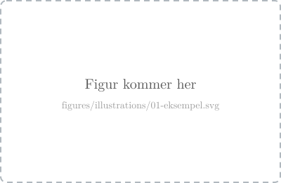
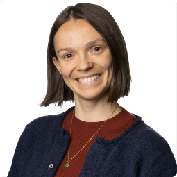

# Jenter i AI

> _Kort pitch for foredraget her._

Foredrag for **Jenter i AI**. Slides på norsk.

## Kjøre slidene

Ingen byggesteg — `talk/slides.md` redigeres direkte.

> **Kjør fra `talk/`, ikke fra rota.** Både `--theme theme.css` og katalogen som
> serveres (`.`) tolkes relativt til der du står. Står du i rota finner ikke Marp
> `theme.css`, og slidene rendres med standardtemaet — de blir stygge, men det er
> ingen feilmelding som forteller deg det.

```bash
cd talk

# Watch mode (live reload på http://localhost:8080/slides.md)
docker run --rm --init -v "$PWD":/home/marp/app -e LANG=$LANG -p 8080:8080 -p 37717:37717 \
  marpteam/marp-cli:v3.2.0 \
  --theme theme.css --watch -s --html=true .
```

Hver linje slutter med backslash `\` — det må være **siste tegn på linja** (ingen
mellomrom etter), ellers splitter zsh kommandoen og du får feil som
`flag needs an argument: 'e'`.

Åpne <http://localhost:8080/slides.md>. Stopp serveren med `Ctrl-C`.

Vil du heller kjøre uten å bytte katalog, pek mountet rett på `talk/`:

```bash
docker run --rm --init -v "$PWD/talk":/home/marp/app -e LANG=$LANG -p 8080:8080 -p 37717:37717 \
  marpteam/marp-cli:v3.2.0 \
  --theme theme.css --watch -s --html=true .
```

Har du `marp` installert lokalt, får du Artifakt i stedet for Inter:

```bash
cd talk && marp --theme theme.css --html -w slides.md
```

### Feilsøking

| Symptom | Årsak |
| --- | --- |
| Slidene har hvit bakgrunn og serif-tekst, ingen logo | Temaet ble ikke funnet — du kjørte fra rota i stedet for `talk/` |
| `Bind for 0.0.0.0:8080 failed: port is already allocated` | En gammel container kjører. `docker ps`, så `docker stop <navn>` |
| Endringer i `slides.md` slår ikke gjennom | Watch-modus følger bare den monterte katalogen — sjekk at mountet peker på `talk/` |

Sjekk hva som faktisk serveres:

```bash
curl -s http://localhost:8080/slides.md | grep -c 0696D7   # 1 = temaet er med, 0 = ikke
```

### Figurer

Statiske figurer ligger som frittstående SVG-er i `talk/figures/illustrations/`,
nummerert etter rekkefølgen i decket (`01-…svg`, `02-…svg`). Portretter i
`talk/figures/people/`.

```markdown

```

eller, for å styre størrelsen:

```html

```

#### Kartet med ring

`hesthagen-kart-ring.png` er `hesthagen-kart.png` beskåret rundt tomta med en rød
ring rundt parkeringsplassen. Ringen er **brent inn i fila**, ikke lagt på i CSS
eller SVG — Marp rendrer hver slide inne i sin egen `<svg>`, og en nøstet
inline-SVG med en ekstern `<image>` kom ikke opp i eksporten. En bakt PNG rendrer
likt i watch-modus, HTML og PDF.

Kildefila er urørt, så ringen kan flyttes ved å kjøre skriptet på nytt fra
`talk/`. `CROP` er utsnittet (behold forholdet 1,6:1, ellers endres høyden på
sliden), `CX/CY/RX/RY` er ringen — alt i kildefilas pikselkoordinater:

```python
from PIL import Image, ImageDraw

SRC = 'figures/illustrations/hesthagen-kart.png'
OUT = 'figures/illustrations/hesthagen-kart-ring.png'
CROP = (100, 190, 1100, 815)          # 1000x625 = 1,6:1
CX, CY, RX, RY = 572, 500, 142, 138   # midt på parkeringsplassen
RED, W, SS = (225, 37, 27, 255), 8, 4 # SS = supersampling, PIL tegner uten antialias

base = Image.open(SRC).convert('RGBA').crop(CROP)
w, h = base.size
ov = Image.new('RGBA', (w * SS, h * SS), (0, 0, 0, 0))
cx, cy = (CX - CROP[0]) * SS, (CY - CROP[1]) * SS
ImageDraw.Draw(ov).ellipse(
    [cx - RX * SS, cy - RY * SS, cx + RX * SS, cy + RY * SS],
    outline=RED, width=W * SS)
base.alpha_composite(ov.resize((w, h), Image.LANCZOS))
base.convert('RGB').save(OUT)
```

CC BY tillater derivater så lenge attribusjonen følger med — den står i
bildeteksten på sliden.

For animerte SVG-er med SMIL (`<animate>` / `<animateMotion>`), bruk `<object>`
i stedet for `` — da kjører nettleseren dem som et levende dokument:

```html
<object data="figures/illustrations/01-eksempel.svg" type="image/svg+xml" width="90%"></object>
```

Interaktive widgets som trenger CSS-søskenselektorer må ligge inline i sliden —
de kan ikke flyttes ut, fordi CSS-en bor utenfor SVG-en.

### Eksportere til fil

Hver linje slutter med backslash `\` — det må være **siste tegn på linja** (ingen
mellomrom etter), ellers splitter zsh kommandoen og du får feil som
`flag needs an argument: 'e'`.

Frittstående HTML:

```bash
docker run --rm -v "$PWD":/home/marp/app/ -e MARP_USER="$(id -u):$(id -g)" -e LANG=$LANG \
    marpteam/marp-cli:v3.2.0 \
    --theme theme.css --allow-local-files --html slides.md -o slides.html
```

PDF:

```bash
docker run --rm -v "$PWD":/home/marp/app/ -e MARP_USER="$(id -u):$(id -g)" -e LANG=$LANG \
    marpteam/marp-cli:v3.2.0 \
    --theme theme.css --allow-local-files --html slides.md --pdf
```

## Publisering

`.github/workflows/publiser-slides.yml` bygger decket ved hver push til `main`
og legger resultatet på `gh-pages`-branchen, som GitHub Pages serverer:

- `index.html` — decket
- `slides.pdf` — samme deck som PDF
- `figures/`, `fonts/` — kopiert med, siden temaet peker på dem relativt

Workflowen kjører også på pull requests, men publiserer ikke da — den laster i
stedet opp resultatet som en artefakt du kan laste ned fra kjøringen. Det gjør
at en ødelagt slide fanges opp før den treffer `main`.

Byggingen bruker samme Docker-image og versjon som README-en over
(`marpteam/marp-cli:v3.2.0`), med `talk/` montert som arbeidsmappe. Da blir CI og
maskinen din identiske.

### Engangsoppsett

Pages må slås på én gang, etter at workflowen har kjørt første gang og laget
`gh-pages`:

**Settings → Pages → Source: Deploy from a branch → `gh-pages` / `(root)`**

eller fra terminalen:

```bash
gh api -X POST repos/sunniva-indrehus-adsk/jenter-i-ai/pages \
  -f 'source[branch]=gh-pages' -f 'source[path]=/'
```

Decket ligger så på `https://sunniva-indrehus-adsk.github.io/jenter-i-ai/`.

## Autodesk-profil

Temaet (`talk/theme.css`) etterligner Autodesks visuelle profil:

| Element | Valg |
| --- | --- |
| Typografi | **Inter** (åpen) — eller **Artifakt** hvis du har den installert |
| Farger | Autodesk-svart `#000000` på hvit `#FFFFFF`, grå `#6E6E6E` til sekundærtekst |
| Aksent | Autodesk-blå `#0696D7` — kulepunkter, lenker, `.kicker`, `.callout` |
| Oransje | `#F5871F` — **kun** `.todo`-lappene, ikke en merkevarefarge |
| Logo | Hvit lockup øverst til venstre på tittel- og `section`-slidene, svart nede til venstre ellers |
| Sidetall | Nede til høyre, grått |

Alt er sjekket inn, så en fersk klone rendrer identisk. Ingenting hentes fra
nett under bygging.

### Logo

`talk/figures/logos/autodesk-logo-black.svg` og `-white.svg` er
[Autodesks primærlogo fra 2021][logo], hentet fra Wikimedia Commons. Filen er
**public domain** der — den består bare av enkle geometriske former og tekst, og
kommer ikke over terskelen for verkshøyde. Den hvite varianten er samme fil med
`fill` byttet til `#FFFFFF`; kilde og lisens står som kommentar i begge filene.

Navnet og logoen er fortsatt et registrert varemerke til Autodesk. Her brukes de
til å vise hvor foredragsholderne jobber, som er vanlig, beskrivende bruk.

[logo]: https://commons.wikimedia.org/wiki/File:Autodesk_Logo_2021.svg

### Skrifter

Autodesks merkevareskrift er **Artifakt**, men den er lisensiert og kan ikke
sjekkes inn. Temaet løser det med en to-trinns stakk:

1. `'Artifakt Element'` / `'Artifakt Legend'` — treffer hvis du har skriften
   installert lokalt (den ligger i `/Library/Fonts` på en Autodesk-Mac).
2. `'Inter'` — pakket med i `talk/fonts/Inter-latin.woff2` (48 kB, variabel
   vekt 100–900) under [SIL Open Font License 1.1][ofl]. Lisensteksten ligger i
   `talk/fonts/Inter-OFL.txt`, som OFL krever.

Inter er en nær nok neo-grotesk til at decket ser likt ut uansett hvilken av de
to som slår til. Docker-eksport bruker Inter, siden containeren ikke ser
systemfontene dine.

[ofl]: https://openfontlicense.org/

> Portrettene i `talk/figures/people/` blir offentlige når repoet publiseres.
> Sjekk at alle avbildede er med på det.

## Slidetyper

| Klasse | Bruk |
| --- | --- |
| `<!-- _class: title -->` | Tittel- og avslutningsslide — svart bakgrunn, hvit lockup. `#` tittel, `##` undertittel, `###` arrangement (settes i versaler) |
| `<!-- _class: title title-photo -->` | Som over, men lys: full-bleed render i bakgrunnen og svart tekst |
| `<!-- _class: section -->` | Kapittelskille — svart, venstrejustert `#` + `##` |
| `<!-- _class: statement -->` | Én stor påstand midt på hvit bakgrunn |
| _(ingen)_ | Vanlig innholdsslide — overskrift med strek under, innhold under |

### Tittelslide med bilde

`title-photo` legger en render i full bredde bak tittelen. Bildet er lyst, så
sliden snus fra svart til hvit og teksten settes i svart. En myk hvit gradient i
nedre venstre hjørne holder tittelen leselig uansett hvor strømlinjene faller,
uten å vaske ut attribusjonen nede til høyre.

Standardbildet er `gløshaugen-streamlines.png`. Bytt det per slide:

```markdown
<!-- _class: title title-photo -->

<style scoped>
section { --photo: url('figures/illustrations/en-annen-render.png'); }
</style>
```

Renderen fra Forma har allerede en «Autodesk Forma»-lockup øverst til venstre,
så temaets egen logo er skrudd av på denne slidetypen — ellers hadde det blitt
to logoer.

## Byggeklosser

```html
<div class="cols-2"> … </div>     <!-- to like spalter -->
<div class="cols-3"> … </div>     <!-- tre kort på rad, lik høyde -->
<div class="card"><h3>…</h3><p>…</p></div>
<div class="callout"> … </div>    <!-- blå ramme til venstre -->
<div class="kicker">Stikkord</div>
<div class="person">             <!-- tekst venstre, stort portrett høyre -->
  <div>… kulepunkter …</div>
  <div class="person-photo">
    <div class="frame"></div>
    <span>Sunniva</span>
  </div>
</div>
<div class="who-row">            <!-- flere små portretter på rad -->
  <div class="who"><span>Sunniva</span></div>
</div>
<div class="figcap"><span class="figref">Figur 1</span> Bildetekst.</div>
<div class="todo">Ting som mangler</div>  <!-- oransje lapp, se under -->
```

### TODO-lapper

Ting som skal fikses før du går på scenen, som en oransje lapp nede til venstre —
rett til høyre for logoen, på samme plass som `footer` har i temaet:

```html
<div class="todo">Sett inn faktiske tall</div>
```

Flere på samme slide: skill dem med `<br>` inni **samme** div. Lappen er ankret i
bunnen og vokser oppover. To `.todo`-divs på én slide legger seg oppå hverandre.

Lappen er absolutt posisjonert, så den skyver aldri innhold rundt — den kan
ligge hvor som helst i slidens markup, og en slide som var trang før blir ikke
trangere. Den er også med i PDF-eksporten, som er poenget: da ser du restene når
du blar gjennom decket.

**Skjul alle før presentasjon** ved å sette én verdi i `theme.css`:

```css
:root { --todo-display: none; }   /* block når du redigerer videre */
```

Rekk over alt som står igjen:

```bash
grep -n 'class="todo"' talk/slides.md
```

`<!-- TODO ~M:SS -->`-kommentarene er noe annet: de er tidsbudsjett per slide,
ikke ting som skal endres, og de skal ikke vises.

### Person-slides

`.person` er et rutenett med tekst til venstre og étt stort portrett til
høyre. Portrettet ligger i `.person-photo > .frame`, som klipper det til en
sirkel på 250 px.

`.frame` finnes fordi portrettene er av ulik type: noen er fotografier som
fyller hele flaten, andre utklipp på hvit studiobakgrunn. Ringen rundt gir
sirkelen en definert kant også mot hvit slide, og en liten `scale(1.05)` kutter
bort kanter som måtte være bakt inn i bildefila.

Portrettene bør være kvadratiske og minst 500×500 px — de vises på 250 px, så
mindre filer blir synlig uskarpe på projektor.

## Konvensjoner

- `<style scoped>` i sliden for layout som bare gjelder den ene sliden.
- `<!-- Say: … -->` for manus, `<!-- TODO ~M:SS -->` for tidsbudsjett per slide.
- Matte er KaTeX (`math: katex` i frontmatter).
- **Eksporter alltid til `talk/`.** Logoen hentes med en relativ `url()` i
  temaet, så en HTML-fil som havner utenfor `talk/` mister merket i hjørnet.

## Kilder og rettigheter

Alt bildemateriale i repoet er enten eget eller åpent lisensiert, siden repoet
er offentlig.

| Fil | Kilde | Lisens |
| --- | --- | --- |
| `figures/logos/autodesk-logo-*.svg` | [Wikimedia Commons][logo] | Public domain (varemerke består) |
| `figures/illustrations/hesthagen-kart.png` | [Kartverket][kv], `topograatone` WMTS, sydd sammen av fliser | CC BY 4.0 — «© Kartverket» |
| `figures/illustrations/gløshaugen-*.png` | Egne Forma-renderinger | Egne |
| `figures/illustrations/02-surrogat-pipeline.svg` | Egen tegning | Egen |
| `figures/illustrations/hesthagen-kart-ring.png` | Derivat av Kartverket-kartet, se «Kartet med ring» | CC BY 4.0 — «© Kartverket» |
| `figures/people/*.png` | Egne portretter | Egne |
| `fonts/Inter-latin.woff2` | [Inter][inter] | SIL OFL 1.1, se `fonts/Inter-OFL.txt` |

[kv]: https://www.kartverket.no/api-og-data/vilkar-for-bruk
[inter]: https://rsms.me/inter/

Attribusjonen for kartet står i bildeteksten på selve sliden — det er et krav
i CC BY, ikke bare god skikk.

### Ikke bruk

`figures/illustrations/hesthagen-regulering.png` er et skjermbilde av
planbeskrivelsen. Teksten er kommunens, men massevolum-illustrasjonene ved siden
av er forslagsstillerens, og de kan ikke ligge på en slide i et offentlig repo.
Innholdet er derfor skrevet av som kulepunkter på «Hva planen faktisk tillater»
i stedet. Trenger sliden et bilde, er svaret en egen Forma-render av
massevolumene, bygget fra reguleringskartet.

Pressefoto fra Adresseavisen og bilder fra Google-søk/Google Maps er
opphavsrettsbeskyttet og kan ikke ligge i et offentlig repo. Å lenke til og
sitere artikkelen er greit, og det er det sliden gjør. Trenger du et ekte
fotografi av tomta, er alternativene et bilde du tar selv, en Forma-render fra
din egen modell, eller et bilde med åpen lisens fra Wikimedia Commons.
