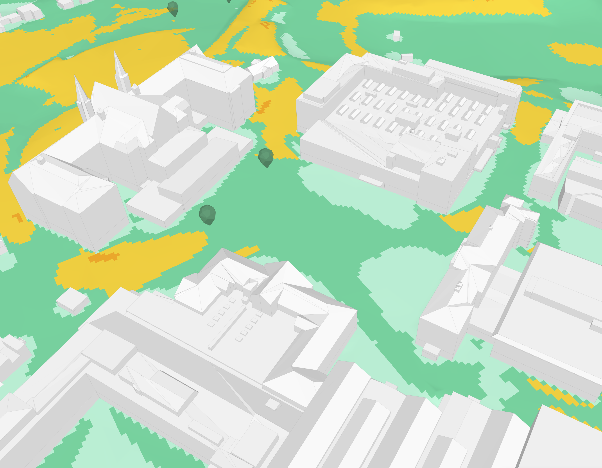

<!-- _class: title title-photo -->
<!-- _header: '24.09.2026' -->
<!-- paginate: false -->

# Jenter i AI

---

<!-- paginate: true -->

# Jenter i Autodesk

  

    

    

  

  
Vilde

  

    

    

  

  
Sunniva

<!--
TATT VARE PÅ: kulepunktene og callout-ene som sto på de to gamle slidene.
Ikke slettet, fordi de er ekte innhold — men de står ikke på sliden nå, og
skal fortelles muntlig i stedet. Vil du ha dem tilbake på flata, er de her:

  Vilde
  - Fra indøk til Autodesk
  - Internship som utvikler under studiene
  - Gøy å bygge produkt i stedet for slides
  - Jobbe i en produktorganisasjon
  callout: Jobbe for en mer bærekraftig verden med koding og matte.

  Sunniva
  - fra Fysmat til Autodesk — å gjøre ligninger om til kode
  - Da: skrev et paper som kanskje fem mennesker i verden har lest
  - Nå: også ligninger i et verktøy tusenvis av arkitekter åpner hver dag
  callout: Samme type jobb, men høyere påvirkning i den virkelige verden.
-->

<!-- Say: la hver av dere fortelle selv, kort. Poenget for publikum er at det
     finnes flere veier inn — indøk og Fysmat, ikke datateknikk — og at «jeg
     gikk ikke datateknikk» ikke er en sperre. Punktene står ikke på sliden
     lenger, så de må sies. -->
<!-- TODO ~1:40 -->

---

<!-- _class: demo overlay -->

<!-- Hesthagen-parkeringen, ikke Filipstad. Bildet sto før på et skjermbilde fra
     demofilmen — en tomt i Oslo, med hele Forma-grensesnittet rundt. Det sa
     «programvare» på en slide som skal si «tomt». Nå er det stedet selv: en
     parkeringsplass full av biler, der halve salen har stått.

     Flyfoto fra 2022, siste årgang før anlegget startet. Rød strek er
     tomtegrensa fra OpenStreetMap, ikke tegnet på frihånd.

     Denne sliden bruker -lys-utgaven: hele flata er like lys, så man ser
     nabolaget rundt like godt som parkeringsplassen. Sliden skal vise STEDET.
     Slide 4 og 5 bruker den dempede, der blikket skal ligge på tomta og
     boblene. Bildet skifter altså her — det leser som at lyset dempes og
     rollene trer fram.

     Bildet lages av tools/hesthagen_slide4.py, varianten «flyfoto». Den har
     sin egen ramme (ROLLER i skriptet) der tomta ligger til høyre og litt opp
     — nettopp for at snakkeboblene på de to neste slidene skal få plass til
     venstre uten å dekke den røde streken.

     Slide 4, 5 og 6 deler dette bildet. Det skal IKKE bytte når arkitekten og
     utbyggeren kommer inn; det er oppbyggingen som er poenget. -->

  
Tidligfase

  <h1>Kunsten å fylle opp en tomt</h1>

  Flyfoto 2022 © Geovekst / Trondheim kommune · Kart © Kartverket, CC BY 4.0

<!-- Say: la bildet stå et øyeblikk før du sier noe. Tomt kvartal, biler der
     halve salen har parkert, ingen streker. Så: «og her begynner spørsmålene.» -->
<!-- TODO ~0:20 -->

---

<!-- _class: demo overlay -->

<!-- Steg 2 av tre på samme bilde: arkitekten kommer inn. Bildet skal IKKE
     bytte — det er oppbyggingen som er poenget, ikke tre forskjellige bilder.

     roles-holder «venstre» klemmer rollene inn i venstre halvdel, så boblene
     ikke legger seg over tomta. Arkitekten står i samme spalte her som på
     neste slide, så figuren ikke hopper når du klikker. -->

  Flyfoto 2022 © Geovekst / Trondheim kommune · Kart © Kartverket, CC BY 4.0

<ul>
<li>Hvor skal bygget stå, og hvor høyt kan det bli?</li>
<li>Blir det bra her (lys, støy, vind)?</li>
</ul>

Arkitekten

<!-- Say: «først kommer arkitekten.» Les de tre spørsmålene, ikke ordrett — de
     står der for publikum, ikke for deg. -->
<!-- TODO ~0:20 -->

---

<!-- _class: demo overlay -->

<!-- Steg 3: utbyggeren kommer inn ved siden av, i høyre spalte av samme
     venstrestilte bærer. -->

  Flyfoto 2022 © Geovekst / Trondheim kommune · Kart © Kartverket, CC BY 4.0

<ul>
<li>Hvor skal bygget stå, og hvor høyt kan det bli?</li>
<li>Blir det bra her (lys, støy, vind)?</li>
</ul>

Arkitekten

<ul>
<li>Går regnestykket opp?</li>
<li>Hva koster det å ombestemme seg om tre måneder?</li>
</ul>

Utbyggeren

<!-- Say: «og så kommer den som betaler.» Arkitekten spør om form, utbyggeren om
     risiko — begge trenger svar før noe er tegnet ferdig. Punchlinja «noen få
     uker der nesten alt avgjøres» sier du her, i stedet for å vise den. -->
<!-- TODO ~0:25 -->

---

<!-- _class: demo overlay logo-card -->

<!-- Logokortet fra filmen (1 s). Det rammer inn Forma-delen: ett foran videoen,
     ett etter vind- og AI-bildene. Marp-klassen logo-card skjuler vår egen
     Autodesk-logo nederst til venstre, siden kortet alt har en midt i bildet. -->

<!-- Say: ikke stå her. Klikk videre med én gang — kortet er en sceneanvisning,
     ikke en slide. -->
<!-- TODO ~0:05 -->

---

<!-- _class: demo flipbook on-dark eget-merke -->

<!-- Fire slides erstatter de sju flipbook-bildene fra demofilmen. Grunnen er
     oppløsning: de gamle var hentet ut av en 1080p-video, tre på 1920 px og
     fem beskåret til 1344. Disse er skjermbilder rett fra Forma, nedskalert
     til 2560 px — 2x slideflata, altså deckets standard for fullflate-bilder.
     Originalene på 3456 px ligger i site-design/original/.

     on-dark her og ikke på de tre neste: bakgrunnen er verdensrommet, altså
     svart nede til venstre, og da må Autodesk-logoen og sidetallet være hvite.
     De tre andre har Formas lyse sidepanel i det hjørnet. -->

Stedet

Velg adresse

---

<!-- _class: demo flipbook eget-merke -->

Kontekst

Velg relevant data

---

<!-- _class: demo flipbook eget-merke -->

Grunnlaget

Sett tomt i kontekst med omgivelser

---

<!-- _class: demo flipbook eget-merke -->

Tomten

Planlegg

---

<!-- _class: demo flipbook eget-merke -->

Forslag

Iterer over utforming

---

# Analyser i Autodesk Forma

  

    
    
  

Støy

Solenergi

Dagslys

Mikroklima

Sol

Vind

<!-- Say: seks analyser, samme modell, samme ettermiddag. La dem se bredden
     her — ikke pek på noen enkelt ennå. Neste slide er den samme, med vind
     markert, og da tar du valget for dem. -->
<!-- TODO ~0:40 -->

---

# Analyser i Autodesk Forma

  

    
    
  

Støy

Solenergi

Dagslys

Mikroklima

Sol

Vind

<!-- Say: «og det er denne ene vi skal bruke resten av tiden på.» Hold på
     rammen et øyeblikk før du går videre — det er her vindfortellingen
     begynner. Ikke forklar hvorfor vind ennå; det kommer på neste slide. -->
<!-- TODO ~0:15 -->

---

<!-- _class: comfort-map -->

<!-- Trinn 1 av 4: kartet alene. Merkelappene kommer én av gangen på de tre
     neste slidene, som er identiske bortsett fra dem — samme grep som
     rollekortene på tomt-sliden og stigen lenger bak. Marp har ingen
     fragmenter, så oppbygging gjøres ved å duplisere sliden.

     Bildet, skalaen og alt annet MÅ være likt på alle fire, ellers hopper det
     når du klikker. Retter du noe her, rett det samme på trinn 2–4. -->

# Vindkomfort

Komfortskalaen

<b>Sitte</b>under 2,5 m/s

<b>Stå</b>over 2,5 m/s

<b>Rusle</b>over 4 m/s

<b>Gå</b>over 6 m/s

<b>Ukomfortabelt</b>over 8 m/s

<!-- Say: la kartet stå alene et øyeblikk. «Dette er svaret — ett kart over
     hele tomta.» Gi salen tid til å se fargene og kjenne igjen stedet før du
     begynner å forklare. Så klikker du, og merkelappene kommer på. -->
<!-- TODO ~0:10 -->

---
<!-- _class: comfort-map -->

<!-- Trinn 2 av 4: første merkelapp. Kartet er nå bygget opp over fire slides —
     først kartet alene, så én merkelapp av gangen. Samme grep som rollekortene
     på tomt-sliden: Marp har ingen fragmenter, så oppbygging gjøres ved å
     duplisere sliden.

     Bildet, skalaen og alt annet MÅ være likt på alle fire, ellers hopper det
     når du klikker. Retter du noe her, rett det samme på de andre tre.

     Prosentene i .pin-ene er lest av fargene i windcomfortgløs.png og
     verifisert mot pikslene: ring 1 og 3 ligger på Rusle (gult), ring 2 på
     Sitte (lysegrønt). Byttes bildet, må de sjekkes på nytt. -->

# Vindkomfort

  
  <b>Åpent felt</b>Ingenting bremser vinden — her går du forbi.

Komfortskalaen

<b>Sitte</b>under 2,5 m/s

<b>Stå</b>over 2,5 m/s

<b>Rusle</b>over 4 m/s

<b>Gå</b>over 6 m/s

<b>Ukomfortabelt</b>over 8 m/s

<!-- Say: her leser du kartet for salen, ett sted av gangen. Tre steder, ikke
     flere — resten ser de selv.

     Det åpne feltet først: ingenting står i veien, så vinden får fart. Gult
     betyr at det er fint å gå gjennom, ikke å bli sittende. -->
<!-- TODO ~0:12 -->

---
<!-- _class: comfort-map -->

<!-- Trinn 3 av 4: første og andre merkelapp. Alt utenom .pin-ene skal være
     identisk med de andre tre trinnene — se kommentaren på trinn 2. -->

# Vindkomfort

  
  <b>Åpent felt</b>Ingenting bremser vinden — her går du forbi.

  
  <b>I le mellom byggene</b>Lunt nok til å sitte. Her kan uterommet ligge.

Komfortskalaen

<b>Sitte</b>under 2,5 m/s

<b>Stå</b>over 2,5 m/s

<b>Rusle</b>over 4 m/s

<b>Gå</b>over 6 m/s

<b>Ukomfortabelt</b>over 8 m/s

<!-- Say: le-sonen mellom byggene: det er her uterommet skal ligge. Lyst grønt er
     «sitte» — kaffen står i ro. Sett den opp mot det åpne feltet du nettopp
     snakket om; kontrasten er hele poenget. -->
<!-- TODO ~0:10 -->

---
<!-- _class: comfort-map -->

<!-- Trinn 4 av 4: alle tre merkelappene på. Alt utenom .pin-ene skal være
     identisk med de andre tre trinnene — se kommentaren på trinn 2. -->

# Vindkomfort

  
  <b>Åpent felt</b>Ingenting bremser vinden — her går du forbi.

  
  <b>I le mellom byggene</b>Lunt nok til å sitte. Her kan uterommet ligge.

  
  <b>Mellom to bygg</b>Vinden presses gjennom og akselererer.

Komfortskalaen

<b>Sitte</b>under 2,5 m/s

<b>Stå</b>over 2,5 m/s

<b>Rusle</b>over 4 m/s

<b>Gå</b>over 6 m/s

<b>Ukomfortabelt</b>over 8 m/s

<!-- Say: passasjen mellom to bygg: vinden presses gjennom et trangere tverrsnitt
     og akselererer. Det er den effekten folk kjenner uten å kunne forklare, og
     den eneste måten å fikse den er å endre byggene — ikke å sette opp en
     skjerm etterpå.

     Poenget å lande, nå som alle tre står på: arkitekten trenger ikke tallene.
     Hun trenger å se hvor det er grønt før volumene er låst. -->
<!-- TODO ~0:15 -->

---

# Hvordan beregner vi vindkomfort?

  

  <h3>Simulering</h3>
  
Vi simulerer hvordan vinden beveger seg mellom byggene når den kommer fra åtte ulike retninger.

+

  

  <h3>Historiske data</h3>
  
Målt vindhastighet og vindretning for stedet: hvor ofte det blåser fra hver retning, og hvor hardt.

  

  <h3>Vindkomfort</h3>
  
Til sammen gir de hvor komfortabelt det er, sted for sted på tomta.

<!-- Say: oppskriften i tre trinn, før figurene på neste slide.

     Trinn 1 og 2 er ingrediensene, trinn 3 er svaret — les plusstegnet og pila
     høyt, så følger salen regnestykket.

     Poenget som er verdt å stoppe på: simuleringen alene sier ingenting om
     komfort. Den sier hva vinden GJØR hvis den kommer fra nordvest. Det er
     først når du vet hvor ofte den faktisk gjør det, at du kan si om et sted
     er lunt. Derfor er de historiske dataene ikke en detalj — uten dem har du
     åtte bilder og ingen konklusjon. -->
<!-- TODO ~0:25 -->
---

<!-- _class: ladder -->

# Hvordan analyserer arkitekten vindforholdene?

  
Før

  
Ekstern vindekspert

  
Uker

<!-- Say: før måtte du leie inn noen. Vindanalyse var en konsulenttjeneste:
     du bestilte den, og du ventet. Den kom sent i prosjektet, den kom én
     gang, og den fortalte deg om det du alt hadde bestemt var greit. -->
<!-- TODO ~0:10 -->

---

<!-- _class: ladder -->

# Hvordan analyserer arkitekten vindforholdene?

  
Før

  
Ekstern vindekspert

  
Uker

  
Med Forma

  
Simulering Fysikkmodell

  
Timer

<!-- Say: simuleringen i verktøyet var det virkelig store steget, og det er
     verdt å si hvorfor: den er enkel å bruke. Du setter ikke opp et mesh, du
     oppgir ikke randbetingelser — du trykker på en knapp, på geometrien du
     alt har tegnet.

     Det er dét som tar eksperten ut av loopen, ikke bare at det går raskere.
     Vindanalysen i Forma gjorde informasjonen tilgjengelig for arkitekten
     selv. -->
<!-- TODO ~0:12 -->

---

<!-- Simuleringen forklart der den hører hjemme: rett etter stigen, mens
     «Simulering — timer» fortsatt henger i salen.

     To ting på sliden, og bare to: bildet er hva vinden GJØR, ligningen er hva
     maskinen regner på. Bildet er argumentet og står størst. Ligningen skal
     ikke leses fra salen — den skal veie, og forklare hvorfor det tar timer.

     Ligningen er den stasjonære RANS-en simpleFoam løser, med vårt eget
     vegetasjonsledd (c_d a |U| U). Den er flyttet hit fra den gamle «Slik
     regner vi det ut»-sliden, som nå ligger i baklomma nederst i fila. -->

# Slik simulerer vi vinden

Simuleringen regner ut fysikken: hvordan luft faktisk beveger seg rundt og mellom byggene.

  
  
Vind fra sørøst.

  
Fysikkmodellen

$$
\begin{aligned}
(\mathbf{U}\cdot\nabla)\mathbf{U} \;=\;& -\nabla p \\
&+\; \nabla\cdot\big[(\nu+\nu_t)\big(\nabla\mathbf{U}+\nabla\mathbf{U}^{\top}\big)\big] \\
&-\; c_d\,a\,\lvert\mathbf{U}\rvert\,\mathbf{U} \\[0.3em]
\nabla\cdot\mathbf{U} \;=\;& \;0
\end{aligned}
$$

<!-- Say: her er simuleringen, siden du nettopp sa «timer».

     Start med bildet, ikke med ligningen: dette er én retning — vind fra
     sørøst — og hver blå linje er veien en luftpakke tar. Følg én av dem med
     hånda: den deles rundt hovedbygningen, skyter forbi gavlen, og bak byggene
     krøller den seg sammen i virvler. Det er DETTE simuleringen regner ut,
     punkt for punkt i luftrommet over tomta.

     Si «én retning» tydelig, og si tallet selv — det står ikke på sliden: én
     til to timer per kjøring, åtte kjøringer for å få komfortkartet de alt har
     sett.

     Så ligningen, og bare som en gest: dette er fysikken den løser. Ikke gå
     gjennom leddene — det står ingen tekst under den, så det er du som bærer
     poenget: den er tung nok til å ta én til to timer, og den må kjøres på
     nytt for hver vindretning.

     Da har salen tallet de trenger til neste steg: åtte retninger x et par
     timer, hver gang du flytter et volum. -->
<!-- TODO ~0:30 -->
---
<!-- _class: demo -->

<!-- Femten utsnitt fra samme skjermopptak på Hesthagen-modellen
     (figures/video/hesthagenestimat.mov), samme kamera hver gang: det eneste
     som endrer seg mellom rutene er bebyggelsen og komfortkartet.

     Ingen tittel og full flate: rekka av ruter ER argumentet, og alt som ikke
     er ruter stjeler plass fra dem. Tittelen «Arkitekten kan raskt vurdere
     mange alternativer» sier du i stedet — den sto her før, se talenotatet.
     Rutene er unummererte og uten bildetekst; rekka skal leses som en
     bevegelse, ikke som en liste du kan peke i.

     demo-klassen gir padding 0 og mørk bakgrunn. 5x3 på 1280x720 gir ruter på
     256x240, altså litt høyere enn kilden (3:2), så object-fit: cover skjærer
     noen piksler av sidene. Det tåler bildene — bygget står midt i ruta.

     gap: 4px er streker i --ink mellom rutene. Vil du ha én sammenhengende
     flate i stedet, sett gap: 0 — da flyter naborutene i hverandre der fargene
     er like, og «femten forsøk» blir vanskeligere å telle.

     Logoen må overstyres til den svarte: demo-klassen antar mørkt bilde og
     setter hvit logo, men disse rutene er lyse, så den hvite forsvinner.

     Ta bare bilder der komfortkartet står ferdig tegnet (grønt/gult) — hopp
     over de blå rutene mens den regner, og ruter der en bygning er valgt. -->

<figure></figure>

<figure></figure>

<figure></figure>

<figure></figure>

<figure></figure>

<figure></figure>

<figure></figure>

<figure></figure>

<figure></figure>

<figure></figure>

<figure></figure>

<figure></figure>

<figure></figure>

<figure></figure>

<figure></figure>

<!-- Say: ikke les opp rutene. Tittelen står ikke på sliden lenger, så den må
     sies: «arkitekten kan raskt vurdere mange alternativer — femten forsøk,
     én ettermiddag.» Så peker du på gårdsrommet i den første ruta mot en av de
     siste: gult blir grønt. Poenget er ikke hvilket forslag som vant, det er
     at du rakk å prøve dem alle.

     Stillbilder og ikke video: video spiller ikke i PDF-eksport, se README.
     Bildene er klippet fra skjermopptaket av Hesthagen-modellen. -->
<!-- TODO ~0:40 -->

---

<!-- Broen fra simuleringen til modellen: alle de kjørte simuleringene ER
     treningsdataene. Sliden er med vilje bare to bokser og en pil — den ene
     halvparten er noe vi allerede har, den andre er det vi fikk ut av det.

     Ikonene er de samme to som brukes om modellene ellers i decket (mesh-kuben
     og det nevrale nettet), så de leses som samme par hvis baklomme-slidene om
     surrogatmodellen tas inn igjen. -->

# Tusenvis av simuleringer

Simuleringen har vært kjørt tusenvis av ganger på tomter over hele verden. Hver kjøring er et eksempel på hvordan vinden beveger seg.

  
  <h3>Det vi har</h3>
  
Tusenvis av ferdige simuleringer: geometri inn, vindfeltet ut. Hver av dem er et løst regnestykke.

  
Treningsdata

  
  <h3>Det vi kunne bygge</h3>
  
En maskinlæringsmodell trent på resultatet av simuleringene. Den regner ikke på fysikken, men kjenner igjen hvordan vinden beveger seg.

  
Vindestimat

<!-- Say: her er vendepunktet, og det er verdt å si sakte.

     Simuleringen er dyr, men vi har kjørt den tusenvis av ganger — på ekte
     tomter, i ekte prosjekter. Alle de kjøringene ligger der som ferdige svar:
     denne geometrien gir dette vindfeltet.

     Og det er nettopp det en maskinlæringsmodell trenger. Tusenvis av par av
     spørsmål og svar. Så vi trente en modell på dem, og den kan predikere
     hvordan vinden beveger seg — uten å regne på fysikken i det hele tatt.

     Poenget å understreke hvis du bare får sagt én ting: det er ikke
     nettverket som er arbeidet, det er treningsdataene. Hver gang en kunde
     betaler for den dyre analysen, blir den et eksempel til den raske. -->
<!-- TODO ~0:35 -->
---

<!-- _class: ladder -->

<!-- Kopi av trinn 2 (slide 20) — flata skal være IDENTISK med den, ellers
     hopper stigen når du kommer tilbake til den her. Retter du et kort på
     slide 20, rett det samme her.

     Den står her fordi stigen har vært ute av bildet i tre slides (simulering,
     iterasjoner, treningsdata). Publikum trenger å se hvor vi var før trinn 3
     kommer på neste slide. -->

# Hvordan analyserer arkitekten vindforholdene?

  
Før

  
Ekstern vindekspert

  
Uker

  
Med Forma

  
Simulering Fysikkmodell

  
Timer

<!-- Say: kort tilbakeblikk, ikke gjenta mesh-forklaringen fra første gang.
     «Her var vi: eksperten tok uker, simuleringen i verktøyet tar timer.» Så
     klikker du, og det tredje trinnet kommer på. -->
<!-- TODO ~0:08 -->

---

<!-- _class: ladder -->

# Hvordan analyserer arkitekten vindforholdene?

  
Før

  
Ekstern vindekspert

  
Uker

  
Med Forma

  
Simulering Fysikkmodell

  
Timer

  
Med Forma

  
Estimat Maskinlæringsmodell

  
Sekunder

<!-- Say: og så det tredje trinnet. Ikke forklar det her — simuleringen og
     treningsdataene har de alt sett. Pek bare på at estimatet finnes, og si
     «det er dette vi skal se på nå». Neste slide er maskinlæringsmodellen.

     Land det muntlig: når svaret kommer mens du tegner, blir analysen noe du
     tar beslutninger PÅ i designfasen — ikke en rapport som bekrefter et valg
     som alt er tatt.

     Poenget å ta med videre, hvis salen bare husker én ting: når noe blir
     hundre ganger billigere, endrer det ikke bare hvor fort det går. Det
     endrer hvem som får bruke det, og når i prosessen. -->
<!-- TODO ~0:15 -->
---

# Maskinlæringsmodellen

  

    

      <figure>
        
        <figcaption>Høydeprofil

</figcaption>
      </figure>
      <figure>
        
        <figcaption>Kategori
          

            <i style="background:#C98A2E"></i>Terreng
            <i style="background:#6B4FD8"></i>Bygg
            <i style="background:#1B7F5A"></i>Vegetasjon
          

        </figcaption>
      </figure>
    

    
Input

  

  <svg class="pil" width="80" height="12" viewBox="0 0 80 12" aria-hidden="true">
    <path d="M0 6 H72" stroke="currentColor" stroke-width="2.4"/>
    <path d="M70 1 L79 6 L70 11 z" fill="currentColor"/></svg>
  

    
    
Nevralt nett

  

  <svg class="pil" width="80" height="12" viewBox="0 0 80 12" aria-hidden="true">
    <path d="M0 6 H72" stroke="currentColor" stroke-width="2.4"/>
    <path d="M70 1 L79 6 L70 11 z" fill="currentColor"/></svg>
  

    

      

        
      

    

    
Output

  

<!-- Say: forrige slide sa at alle simuleringene ER treningsdataene, og
     viste nett-ikonet. Her er det samme nettet i bruk: hva som går inn, og
     hva som kommer ut. Én retning, stor nok til at salen ser feltet.

     Venstre: hele inngangen. Høyden på alt som står der, og hva det er —
     terreng, bygg eller vegetasjon. Ingen mesh, ingen randbetingelser. Og
     merk: ingen vindretning i inngangen.

     Høyre: vindfeltet. Lyst er skjermet, mettet er eksponert. Bilde inn,
     bilde ut — rammen som gjør den forståelig for en AI-sal.

     Retningen står ikke på sliden. Feltet er nordøst-kjøringen, så si det om
     noen spør — men figuren handler om inn og ut, ikke om retninger.

     Gjentakelsen sier du, den står ikke på sliden: det samme kjøres for alle
     åtte retningene i én batch — ikke åtte modeller — og vektes med vindrosen
     til komfortkartet de så på Gløshaugen-sliden.

     Har du tid til overs: 8 retninger x noen sekunder mot 8 x flere timer CFD.
     Det er hele poenget med at den kan stå på mens man tegner.

     Spør noen hvordan retningen kommer inn når den ikke er en inngang: vi
     roterer geometrien til nettets orientering, kjører, og roterer svaret
     tilbake. Det er med vilje ikke tegnet — det er et implementasjonsdetalj. -->
<!-- TODO ~0:40 -->

---

# Vi står på stand

  

  Vilde

  

  Sunniva

<!-- TODO: legg inn figures/people/elizabeth.jpg -->

  

  Elizabeth

<!-- TODO: legg inn figures/people/guro.jpg -->

  

  Guro

## Kom og spør oss om alt vi ikke fikk plass til her!

Portretter av Elizabeth og Guro mangler

<!-- TODO ~0:20 -->

---
<!-- ──────────────────────────────────────────────────────────────────────
     BAKLOMMA. Alt under denne linja er utenfor taletiden.

     Her ligger to sett slides:

     1. «Fra vind: komfortabelhet» (tre trinn). Hoveddecket bruker nå
        «Vindkomfort» (to trinn) i stedet — de sier mye av det samme, men
        «Vindkomfort» viser kartet over hele tomta med de påpekte stedene,
        der «Fra vind» har komfortskalaen og kartet av hovedbygget.
        «Hvordan beregner vi vindkomfort?», som lå her, står nå i hovedløpet
        rett etter «Vindkomfort».

     2. To av modell-slidene som sto i hovedløpet mellom «Tusenvis av
        simuleringer» og de 15 rutene: «To modeller, ett svar» og
        «Surrogatmodellen». Den tredje, «Maskinlæringsmodellen», står nå
        som siste innholdsslide i hovedløpet i stedet — etter de 15 rutene,
        rett før «Vi står på stand».
        NB: det ligger to slides som heter «Surrogatmodellen» her — main sin
        boksfigur med treningsløkka, og vår pipeline-skisse lenger ned.

     3. Blokka som alt lå i baklomma: CFD-ligningen, CFD mot surrogat og
        pipeline-skissen. Kommentaren under forklarer rekkefølgen.

     Skal noe av dette opp i hoveddecket igjen, må du sjekke at det ikke
     dublerer main sin «To modeller, ett svar» eller «Surrogatmodellen».
     ────────────────────────────────────────────────────────────────────── -->
<!-- _class: result-build -->

# Fra vind: komfortabelhet

  

    
Komfortskalaen — Lawson LDDC

    

      
<b>Sitte</b>under 2,5 m/s

      
<b>Stå</b>over 2,5 m/s

      
<b>Rusle</b>over 4 m/s

      
<b>Gå</b>over 6 m/s

      
<b>Ukomf.</b>over 8 m/s

    

  

  
  
Komfortkart for vind, hovedbygget på Gløshaugen.

<!-- Say: dette er svaret arkitekten ser. Ingen modell, ingen ligning — bare
     resultatet, og fargene som sier hva det betyr. La det stå litt.
     De to neste slidene legger på hvor svaret kommer fra. -->
<!-- TODO ~0:30 -->

---

<!-- _class: result-build -->

# Fra vind: komfortabelhet

  
  
Fysikkmodellen

$$
\begin{aligned}
(\mathbf{U}\cdot\nabla)\mathbf{U} \;=\;& -\nabla p \\
&+\; \nabla\cdot\big[(\nu+\nu_t)\big(\nabla\mathbf{U}+\nabla\mathbf{U}^{\top}\big)\big] \\
&-\; c_d\,a\,\lvert\mathbf{U}\rvert\,\mathbf{U} \\[0.3em]
\nabla\cdot\mathbf{U} \;=\;& \;0
\end{aligned}
$$

  
Timer per iterasjon.

  

    
Komfortskalaen — Lawson LDDC

    

      
<b>Sitte</b>under 2,5 m/s

      
<b>Stå</b>over 2,5 m/s

      
<b>Rusle</b>over 4 m/s

      
<b>Gå</b>over 6 m/s

      
<b>Ukomf.</b>over 8 m/s

    

  

  
  
Komfortkart for vind, hovedbygget på Gløshaugen.

<!-- Say: «dette er hvordan vi FAKTISK regner det ut.» Ligningen er den
     stasjonære RANS-en simpleFoam løser, med vårt eget vegetasjonsledd. Ikke gå
     gjennom leddene her — den annoterte versjonen kommer på Fysikkmodell-sliden.
     Poenget nå er bare: timer. -->
<!-- TODO ~0:25 -->

---

<!-- _class: result-build -->

# Fra vind: komfortabelhet

  
  
Fysikkmodellen

$$
\begin{aligned}
(\mathbf{U}\cdot\nabla)\mathbf{U} \;=\;& -\nabla p \\
&+\; \nabla\cdot\big[(\nu+\nu_t)\big(\nabla\mathbf{U}+\nabla\mathbf{U}^{\top}\big)\big] \\
&-\; c_d\,a\,\lvert\mathbf{U}\rvert\,\mathbf{U} \\[0.3em]
\nabla\cdot\mathbf{U} \;=\;& \;0
\end{aligned}
$$

  
Timer per iterasjon.

  

    
Komfortskalaen — Lawson LDDC

    

      
<b>Sitte</b>under 2,5 m/s

      
<b>Stå</b>over 2,5 m/s

      
<b>Rusle</b>over 4 m/s

      
<b>Gå</b>over 6 m/s

      
<b>Ukomf.</b>over 8 m/s

    

  

  
  
Komfortkart for vind, hovedbygget på Gløshaugen.

  
  
Surrogatmodellen

  
Nevralt nett, trent på ferdige fysikkmodell-kjøringer.

  
Sekunder per iterasjon.

<!-- Say: «og dette er den andre veien til det samme bildet.» Begge pilene
     peker inn mot samme kart — det er hele argumentet. Så: timer mot sekunder,
     og hvorfor det avgjør hvem som kan bruke modellen. -->
<!-- TODO ~0:30 -->

---

# To modeller, ett svar

Begge svarer på det samme spørsmålet — hvordan vinden oppfører seg mellom byggene. Forskjellen er hvor nøyaktig svaret blir, og hvor lenge du må vente på det.

  

    
    <h3>Fullverdig CFD</h3>
  

  
Timerper kjøring

  <ul>
    <li>Nøyaktig, og etterprøvbar</li>
    <li>Kjøres én gang, til slutt</li>
    <li><b>Dokumenterer</b> et valg som alt er tatt</li>
  </ul>

  

    
Komfortskalaen — Lawson LDDC

    

      
<b>Sitte</b>under 2,5 m/s

      
<b>Stå</b>over 2,5 m/s

      
<b>Rusle</b>over 4 m/s

      
<b>Gå</b>over 6 m/s

      
<b>Ukomf.</b>over 8 m/s

    

  

  
  
Samme komfortkart — uansett hvilken av dem som regnet det ut.

  

    
    <h3>Surrogatmodellen</h3>
  

  
Sekunderper kjøring

  <ul>
    <li>Omtrentlig, med et avvik vi måler</li>
    <li>Kjøres hele tiden, mens man tegner</li>
    <li><b>Tar</b> valget, sammen med arkitekten</li>
  </ul>

<!-- Say: les inngangslinja først — den gjør at de to sidene leses som to
     nøyaktighetsnivåer for samme svar, og ikke som to ulike verktøy.
     Pek så på «Timer» mot «Sekunder». Det er den forskjellen som avgjør hvem
     som kan bruke modellen, og når. Kartet i midten er beviset på at de svarer
     på det samme. -->
<!-- TODO ~0:45 -->

---

# Surrogatmodellen

<!--
FIGUREN ER VERIFISERT MOT KODEN i spacemakerai/wind-surrogate. Det viktigste
funnet: vindretningen er IKKE en inngang til nettet. Geometrien roteres i
stedet, og for komfort kjøres alle åtte retninger som én batch:

  lib/prediction.py:53-61   predict(): rotate(-direction) → nett → rotate(+direction)
  lib/prediction.py:64-86   predict_comfort(): åtte rotasjoner i én batch,
                            deretter vektet med vindrosen
  lib/constants.py:35       WIND_DIRECTIONS = [0,45,...,315]
  lib/constants.py:37       GROUND_MEASUREMENT_HEIGHT = 1.75 m
  lib/constants.py:22-31    200x200 px site i 500x500 px kontekst, 1,5 m/px
  lib/utils/model.py        ONNX Runtime, assets/latest.onnx
  lambdas/handler_trigger_data_generation.py
                            treningsdata hentes løpende fra SUCCEEDED-analyser
                            i wind-analysis-backend-prod

Detaljene står i SVG-filens egen header, og manuset i Say-kommentaren nederst.
(Ikke skriv en HTML-kommentar inni denne: den ytre slutter ved det første
sluttmerket, og resten lekker ut som brødtekst.)
-->

Modellen har sett så mange løsninger at den kjenner igjen svaret.

Gir skissen mening?

<!-- Say: rammen som gjør det forståelig for en AI-sal: det er bilde-til-bilde.
     Inn: terreng og bygninger som høydekart. Ut: et hastighetsfelt.

     De to poengene som er verdt tiden:

     1. Nettet vet ikke hva en vindretning er. Vi ROTERER geometrien i stedet,
        kjører nettet, og roterer svaret tilbake. Åtte retninger blir åtte
        rotasjoner i én batch. Samme oppskrift som CFD-en — «gjenta for hver
        retning, vekt med vindrosen» — men åtte nettverkskjøringer i stedet for
        åtte timelange simuleringer.

     2. Treningsdataene er kundenes egne CFD-analyser. En lambda plukker opp
        ferdige kjøringer fra produksjon og gjør dem til treningseksempler. Hver
        gang noen betaler for den dyre analysen, blir den et eksempel til den
        raske. Det er derfor det er treningsdataene, ikke nettverket, som er
        arbeidet. -->
<!-- TODO ~1:05 -->

---

<!-- ─────────────────────────────────────────────────────────────────
     BAKLOMME — ikke en del av hovedløpet.

     Tre slides som sto mellom stigen og «Arkitekten bruker begge»:
       «Slik regner vi det ut» (CFD-ligningen, 1–2 timer)
       «For lenge når du drodler» (CFD mot surrogat)
       «Surrogatmodellen» (skissen av pipelinen)

     De hører sammen og må flyttes som én blokk: «For lenge når du
     drodler» innfører surrogatmodellen, og «Surrogatmodellen» tegner
     pipelinen.

     NB: den fjerde sliden i blokka — surrogat-figuren, den konkrete
     inn/ut-versjonen — er FLYTTET UT og står nå i hovedløpet som
     slide 26, rett etter «Tusenvis av simuleringer». Den lener seg
     derfor ikke lenger på skissen, og den står ikke og venter på at
     disse tre skal hentes fram. Tas de inn igjen, kommer skissen
     ETTER den konkrete figuren — vurder om det er rekkefølgen du vil.

     Til sammen ca. 2:00 av taletiden. Skal de tilbake, hører de hjemme
     rett etter den tredje stige-sliden. -->

<!-- _class: result-build -->

# Slik regner vi det ut

En simulering av selve fysikken — hvordan luft beveger seg mellom byggene. Én til to timer per kjøring.

  
  
Fysikkmodellen

$$
\begin{aligned}
(\mathbf{U}\cdot\nabla)\mathbf{U} \;=\;& -\nabla p \\
&+\; \nabla\cdot\big[(\nu+\nu_t)\big(\nabla\mathbf{U}+\nabla\mathbf{U}^{\top}\big)\big] \\
&-\; c_d\,a\,\lvert\mathbf{U}\rvert\,\mathbf{U} \\[0.3em]
\nabla\cdot\mathbf{U} \;=\;& \;0
\end{aligned}
$$

  
1–2 timer per kjøring.

  

    
Komfortskalaen — Lawson LDDC

    

      
<b>Sitte</b>under 2,5 m/s

      
<b>Stå</b>over 2,5 m/s

      
<b>Rusle</b>over 4 m/s

      
<b>Gå</b>over 6 m/s

      
<b>Ukomf.</b>over 8 m/s

    

  

  
  
Komfortkart for vind, Gløshaugen.

<!-- Say: «og dette er hvordan vi faktisk regner det ut.» Ligningen er den
     stasjonære RANS-en simpleFoam løser, med vårt eget vegetasjonsledd. Ikke gå
     gjennom leddene her — den annoterte versjonen kommer på Fysikkmodell-sliden.
     Poenget nå er bare: dette er en kompleks fysikkmodell, og den tar én til to
     timer. Si tallet sakte — det er oppsettet til neste slide. -->
<!-- TODO ~0:25 -->

---

<!-- _class: result-build -->

# For lenge når du drodler

Derfor bygget vi surrogatmodellen: trent på resultatene fra tusenvis av simuleringer, og gir samme kart på sekunder.

  
  
Fysikkmodellen

$$
\begin{aligned}
(\mathbf{U}\cdot\nabla)\mathbf{U} \;=\;& -\nabla p \\
&+\; \nabla\cdot\big[(\nu+\nu_t)\big(\nabla\mathbf{U}+\nabla\mathbf{U}^{\top}\big)\big] \\
&-\; c_d\,a\,\lvert\mathbf{U}\rvert\,\mathbf{U} \\[0.3em]
\nabla\cdot\mathbf{U} \;=\;& \;0
\end{aligned}
$$

  
1–2 timer per kjøring.

  

    
Komfortskalaen — Lawson LDDC

    

      
<b>Sitte</b>under 2,5 m/s

      
<b>Stå</b>over 2,5 m/s

      
<b>Rusle</b>over 4 m/s

      
<b>Gå</b>over 6 m/s

      
<b>Ukomf.</b>over 8 m/s

    

  

  
  
Komfortkart for vind, Gløshaugen.

  
  
Surrogatmodellen

  
Nevralt nett, trent på tusenvis av ferdige simuleringer.

  
Sekunder per kjøring.

<!-- Say: her er svingen. «Én til to timer er greit når beslutningen er tatt.
     Men arkitekten sitter og drodler — da er det for lenge.»

     Så den andre veien til det samme bildet: en maskinlæringsmodell trent på
     resultatene fra tusenvis av simuleringer. Den har lært hvordan vinden
     beveger seg på en tomt, og gir et estimat på sekunder.

     Begge pilene peker inn mot samme kart — det er hele argumentet. -->
<!-- TODO ~0:30 -->

---

# Surrogatmodellen

<!--
FIGUREN ER VERIFISERT MOT KODEN i spacemakerai/wind-surrogate. Det viktigste
funnet: vindretningen er IKKE en inngang til nettet. Geometrien roteres i
stedet, og for komfort kjøres alle åtte retninger som én batch:

  lib/prediction.py:53-61   predict(): rotate(-direction) → nett → rotate(+direction)
  lib/prediction.py:64-86   predict_comfort(): åtte rotasjoner i én batch,
                            deretter vektet med vindrosen
  lib/constants.py:35       WIND_DIRECTIONS = [0,45,...,315]
  lib/constants.py:37       GROUND_MEASUREMENT_HEIGHT = 1.75 m
  lib/constants.py:22-31    200x200 px site i 500x500 px kontekst, 1,5 m/px
  lib/utils/model.py        ONNX Runtime, assets/latest.onnx
  lambdas/handler_trigger_data_generation.py
                            treningsdata hentes løpende fra SUCCEEDED-analyser
                            i wind-analysis-backend-prod

Detaljene står i SVG-filens egen header, og manuset i Say-kommentaren nederst.
(Ikke skriv en HTML-kommentar inni denne: den ytre slutter ved det første
sluttmerket, og resten lekker ut som brødtekst.)
-->

Modellen har sett så mange løsninger at den kjenner igjen svaret.

Gir skissen mening?

<!-- Say: rammen som gjør det forståelig for en AI-sal: det er bilde-til-bilde.
     Inn: terreng og bygninger som høydekart. Ut: et hastighetsfelt.

     De to poengene som er verdt tiden:

     1. Nettet vet ikke hva en vindretning er. Vi ROTERER geometrien i stedet,
        kjører nettet, og roterer svaret tilbake. Åtte retninger blir åtte
        rotasjoner i én batch. Samme oppskrift som CFD-en — «gjenta for hver
        retning, vekt med vindrosen» — men åtte nettverkskjøringer i stedet for
        åtte timelange simuleringer.

     2. Treningsdataene er kundenes egne CFD-analyser. En lambda plukker opp
        ferdige kjøringer fra produksjon og gjør dem til treningseksempler. Hver
        gang noen betaler for den dyre analysen, blir den et eksempel til den
        raske. Det er derfor det er treningsdataene, ikke nettverket, som er
        arbeidet. -->
<!-- TODO ~1:05 -->

---

<!-- ─────────────────────────────────────────────────────────────────
     BAKLOMME 2 — ikke en del av hovedløpet.

     Tre slides som sto mellom stigen og «Den kjører mens du tegner»:
       «Arkitekten bruker begge» (CFD mot surrogat, egenskap for egenskap)
       «Regulering av Hesthagen» (case-skilleark)
       «Hesthagen — fra parkeringsplass til bygg»

     De to siste hører sammen: skillearket annonserer caset.

     NB: «Den kjører mens du tegner» står fortsatt i hovedløpet, og
     rutene der er klippet fra Hesthagen-modellen. Uten caset må du
     fortelle den sliden uten å lene deg på at salen kjenner tomta.

     Til sammen ca. 1:20 av taletiden. -->

# Arkitekten bruker begge

De to brukes om hverandre: estimatet mens ideene står på skissestadiet, simuleringen når valget skal tas og dokumenteres. Samme spørsmål, to nivåer av nøyaktighet — og to helt ulike ventetider.

  

    
    <h3>Fullverdig CFD</h3>
  

  
1–2 timerper kjøring

  <ul>
    <li>Nøyaktig, og etterprøvbar</li>
    <li>Kjøres ved de viktige beslutningene</li>
    <li><b>Dokumenterer</b> valget som er tatt</li>
  </ul>

  

    
Komfortskalaen — Lawson LDDC

    

      
<b>Sitte</b>under 2,5 m/s

      
<b>Stå</b>over 2,5 m/s

      
<b>Rusle</b>over 4 m/s

      
<b>Gå</b>over 6 m/s

      
<b>Ukomf.</b>over 8 m/s

    

  

  
  
Samme komfortkart — uansett hvilken av dem som regnet det ut.

  

    
    <h3>Surrogatmodellen</h3>
  

  
Sekunderper kjøring

  <ul>
    <li>Et estimat, med et avvik vi måler</li>
    <li>Kjøres hele tiden, mens man tegner</li>
    <li><b>Itererer</b> seg fram til valget</li>
  </ul>

<!-- Say: oppsummeringen av hele vinddelen, og den skal ikke leses som «velg
     én». Arkitekten bruker begge, om hverandre: estimatet for å prøve ti ideer
     på en ettermiddag, simuleringen når noe skal bestemmes og dokumenteres.

     Pek på «1–2 timer» mot «Sekunder», og på kartet i midten: det er beviset på
     at de svarer på det samme spørsmålet. -->
<!-- TODO ~0:45 -->

---

# Regulering av Hesthagen
## Case
<!-- TODO ~0:10 -->

---

# Hesthagen — fra parkeringsplass til bygg

Tomta og planen

- Brukt som NTNU-parkering mellom Klæbuveien og Gløshaugen
- En del av **NTNUs samlokaliseringstrategi**
- Fem etasjers hus der bilene står i dag
- Torg, trapp, gangbru og en offentlig plass rundt bygget

<!--
BRUK -ring-fila her, ikke hesthagen-kart.png. Den røde ringen rundt tomta er
brent inn i derivatfila; kildekartet har ingen ring. Marp klarte ikke å legge
ringen på i inline SVG (hver slide rendres inne i sin egen <svg>, og en nøstet
SVG med ekstern <image> falt ut av eksporten), så den ligger i PNG-en.

Skal ringen flyttes: skriptet står i README under «Kartet med ring».
-->

Figur Hesthagen, mellom Klæbuveien og Gløshaugen. Rød ring: tomta som reguleres. Kart: © <a href="https://www.kartverket.no/">Kartverket</a>, CC BY 4.0.

Mye av det planen lover, er uterom.

<!-- Say: «dette er tomta, og halve salen har parkert der.» Gjør det lokalt før
     du gjør det teknisk, og les callouten sakte — det er svingen inn til
     vindanalysen.

     Detaljregulering r20200032, vedtatt av bystyret 2. mars 2023. Kildene lå på
     sliden før, men 0,58em på projektor leser ingen — ta dem muntlig om noen
     spør:
       https://www.trondheim.kommune.no/aktuelt/kunngjoring-arealplan/arkiv-vedtatte-planer/eldre/20232/Hesthagen-og-del-av-Hogskoleparken-gnr-bnr-405-39-405-177-405-101-mfl-detaljregulering-r20200032/
       https://www.adressa.no/nyheter/trondheim/i/3MOkAP/naa-starter-det-enorme-byggeprosjektet-i-trondheim
-->
<!--
FIGUR: sliden tåler en massevolum-render i stedet for kartet. Lag den i Forma fra
reguleringskartet og eksporter selv — IKKE klipp ut illustrasjonene fra
planbeskrivelsen. De er forslagsstillerens, og repoet er offentlig (se «Ikke
bruk» i README).
-->
<!-- TODO ~0:50 -->

---
<!-- Main sin bakte fullbleed-versjon av surrogat-figuren. Hoveddecket bruker
     nå «Maskinlæringsmodellen» i stedet: samme innhold, men bygd i CSS av
     ekte skjermbilder, så etikettene arver temaets skrift og farger og kan
     rettes uten å rendre en PNG på nytt. Vil du ha den bakte tilbake, bytt
     de to. -->

<!-- Say: den konkrete versjonen av skissen på forrige slide. Pek på de to
     bildene til venstre: høyden på alt som står der, og hva det er — terreng,
     bygning eller vegetasjon. Det er hele inngangen. Ingen mesh, ingen
     randbetingelser.

     Til høyre: åtte felt, ett per retning. Understrek at det ikke er åtte
     modeller — det er én modell kjørt åtte ganger på rotert geometri, og de
     vektes med vindrosen til det komfortkartet de så på Gløshaugen-sliden.

     Har du tid til overs: 8 retninger x noen sekunder mot 8 x flere timer CFD.
     Det er hele poenget med at den kan stå på mens man tegner. -->
<!-- TODO ~0:40 -->
