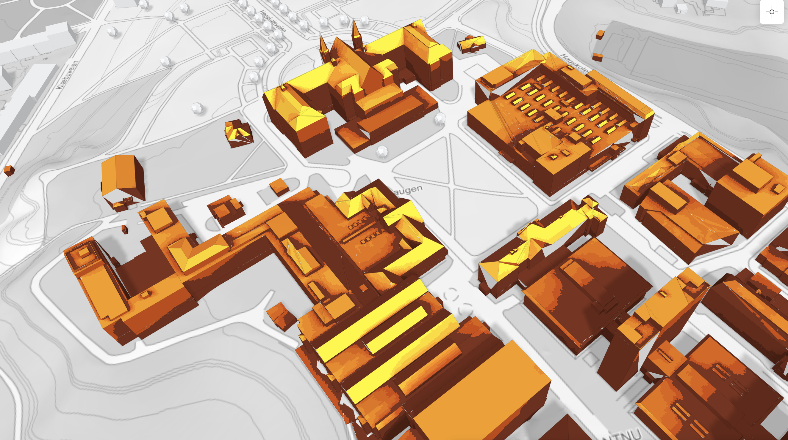
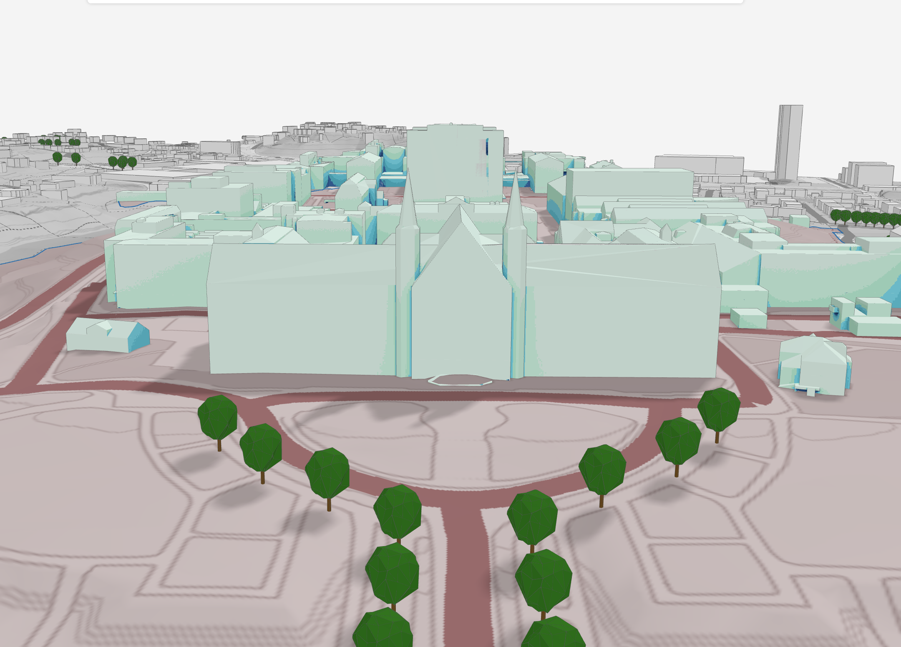
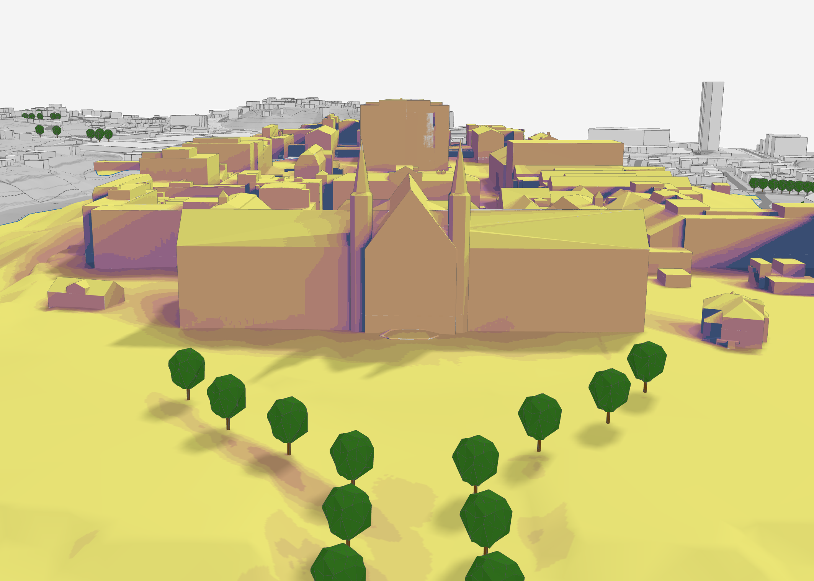

<!-- _class: title title-photo -->
<!-- _header: '24.09.2026' -->
<!-- paginate: false -->

# Mer brukt, men mindre nøyaktig

### Jenter i AI

---

# Fra indøk til Autodesk

Ville bygge produkt i stedet for slides

- Internship som utvikler under studiene
- Bruke kode til å løse komplekse problemer
- Jobbe i en produktorganisasjon

  

  Vilde

Det er spennende å kombinere matematikk, algoritmer og programvareutvikling for å bidra til en mer bærekraftig verden.</em>

<!-- Say: la Vilde fortelle selv — 2 min. Poenget for publikum: det finnes flere veier inn. -->
<!-- TODO ~2:00 -->

---

<!-- paginate: true -->

# Fra fysmat til Autodesk

- Fysiker som ble programmerer
- Jobber med *…* i Forma hos Autodesk
- Kort om veien hit

  

  Sunniva

<!-- Say: kort og personlig — 1 min, ikke mer. -->

---

<!-- _class: demo -->

<!--
«What is Forma Site Design» fra YouTube. Marp trenger --html=true for at
<iframe> skal rendres; det ligger allerede i kommandoen i README.

Embedden krever nett i salen, og den fungerer ikke i PDF-eksport. Last ned en
lokal kopi som reserve og bytt iframe-en (og skriptet) mot:
  <video src="figures/video/forma-demo.mp4" controls muted playsinline></video>
CSS-en i theme.css håndterer begge.

start=18 og end=74: klippet går fra 0:18 til 1:14 — 56 sekunder, spilt i vanlig
hastighet. Bruker du den lokale reservefila i stedet, blir det #t=18,74 på
slutten av src.

rel=0 og modestbranding=1 demper YouTubes egne forslag. autoplay=1 krever
mute=1 — nettlesere blokkerer autoplay med lyd. Lyden skal av uansett.

Tittelkortet «Autodesk Forma» ligger over videoen de første 5 sekundene og fader
ut. Teksten står i .demo-intro-diven under, utseendet i theme.css, og de 5
sekundene i setTimeout-en i skriptet.

cc_load_policy=0 og iv_load_policy=3 ber om ingen undertekster og ingen
annotasjoner. cc_load_policy er bare et hint — er undertekster slått på i din
egen YouTube-konto vinner den, så sjekk CC-knappen i spilleren før du går på.
-->

<iframe
  id="forma-demo"
  src="https://www.youtube-nocookie.com/embed/1ovhhMWpohw?start=18&end=74&rel=0&modestbranding=1&playsinline=1&cc_load_policy=0&iv_load_policy=3"
  data-autoplay-src="https://www.youtube-nocookie.com/embed/1ovhhMWpohw?start=18&end=74&rel=0&modestbranding=1&playsinline=1&cc_load_policy=0&iv_load_policy=3&autoplay=1&mute=1"
  title="What is Forma Site Design"
  allow="autoplay; encrypted-media; picture-in-picture; fullscreen"
  referrerpolicy="strict-origin-when-cross-origin"></iframe>

  

---

# Analyser i Autodesk Forma

Støy

Solenergi

Dagslys

Mikroklima

Sol

Vind

---

<!-- _class: section -->

# Regulering av Hesthaugen

---

# Hesthagen — fra parkering til byggeplass

Tomta

- Nedlagt NTNU-parkering mellom Klæbuveien og Gløshaugen
- Detaljregulert av Trondheim kommune (R20200034)
- …

Kilder 
Trondheim kommune, <a href="https://www.trondheim.kommune.no/aktuelt/kunngjoring-arealplan/arkiv-vedtatte-planer/eldre/20232/Hesthagen-og-del-av-Hogskoleparken-gnr-bnr-405-39-405-177-405-101-mfl-detaljregulering-r20200032/">vedtatt detaljregulering</a> og <a href="https://www.trondheim.kommune.no/globalassets/10-bilder-og-filer-eksternt/10-byutvikling/byplankontoret/1c_vedtatt-plan/2023/campus_hesthagen-og-del-av-hogskoleparken-gnrbnr-40539-405177-405101-m.fl.-detaljregulering--r20200034/planbeskrivelse.pdf">planbeskrivelse (PDF)</a> 
Adresseavisen, <a href="https://www.adressa.no/nyheter/trondheim/i/3MOkAP/naa-starter-det-enorme-byggeprosjektet-i-trondheim">«Nå starter det enorme byggeprosjektet i Trondheim»</a>

Figur Hesthagen, mellom Klæbuveien og Gløshaugen. Kart: © <a href="https://www.kartverket.no/">Kartverket</a>, CC BY 4.0.

---

<!-- _class: statement -->

# En påstand som fortjener hele sliden

---

# En likning, om det trengs

$$
E = \int_{\Omega} L(\omega)\,\cos\theta\,\mathrm{d}\omega
$$

<!-- KaTeX er slått på i frontmatter (math: katex). -->

---

<!-- _class: section -->

# Del 2

## …

---

<!-- _class: section -->

# Del 3

## …

---

# Hva nå?

Kom i gang

- Ressurs 1 — …
- Ressurs 2 — …

Ta kontakt

- …

---

# Takk for oppmerksomheten!

  

  Vilde

  

  Sunniva

<!-- TODO: legg inn figures/people/elizabeth.jpg -->

  

  Elizabeth

<!-- TODO: legg inn figures/people/guro.jpg -->

  

  Guro

Vi står på stand — kom og spør oss om alt vi ikke fikk plass til her!

