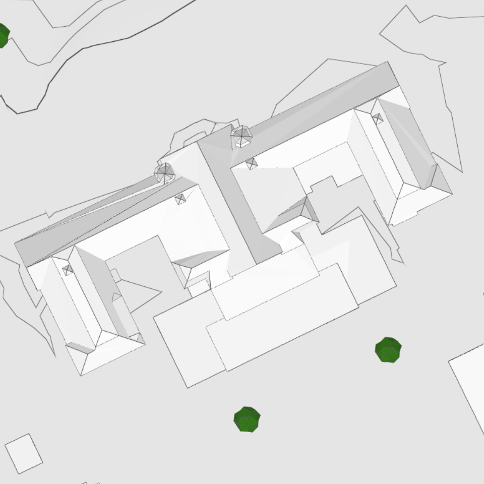
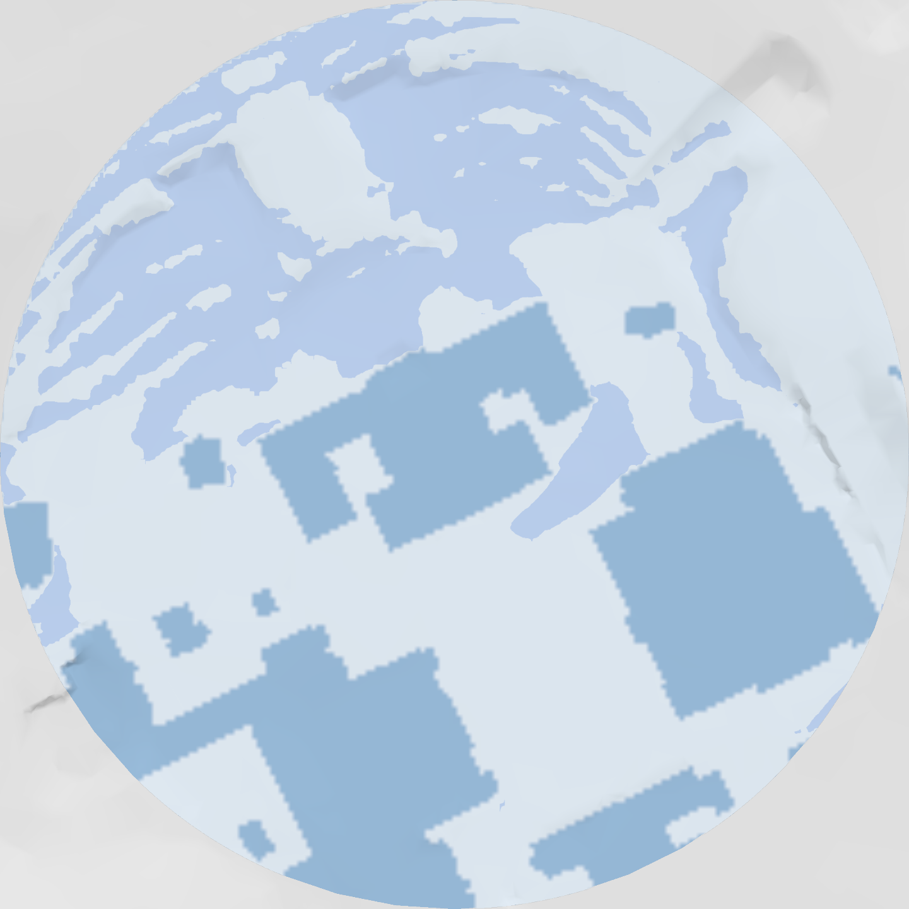

<!-- _class: title title-photo -->
<!-- _header: '24.09.2026' -->
<!-- paginate: false -->

<!-- TITTELEN STÅR IKKE SKREVET HER, med vilje: arrangementets logo SIER
     «Jenter i AI», og en h1 med samme ordene under den var det samme to ganger.
     Skal teksten tilbake, legg inn «# Jenter i AI» — temaet styler den fortsatt
     (section.title h1 / section.title-photo h1), så den lander nede til venstre
     som før, i svart.

     Logoen står nede til HØYRE. Der er renderingen flat og lys (195,206,215),
     så den mørke vinrøde skriften i logoen leses rent, uten plate bak. Nede til
     venstre ligger det hvite sjiktet som tittelteksten trengte — det står
     igjen, og leses nå som en myk vignett.

     «Building geometries by Geodata AS» var brent inn i bildefila nøyaktig der
     logoen nå står. Den er malt ut (flata var ensfarget, så lappen er usynlig)
     — se README, «Tittelslide med bilde», for hvor krediteringen er flyttet. -->

  

---

<!-- paginate: true -->

# Jenter i Autodesk

  

    

    

  

  
Vilde

  

    

    

  

  
Sunniva

<!--
TATT VARE PÅ: kulepunktene og callout-ene som sto på de to gamle slidene.
Ikke slettet, fordi de er ekte innhold — men de står ikke på sliden nå, og
skal fortelles muntlig i stedet. Vil du ha dem tilbake på flata, er de her:

  Vilde
  - Fra indøk til Autodesk
  - Internship som utvikler under studiene
  - Gøy å bygge produkt i stedet for slides
  - Jobbe i en produktorganisasjon
  callout: Jobbe for en mer bærekraftig verden med koding og matte.

  Sunniva
  - fra Fysmat til Autodesk — å gjøre ligninger om til kode
  - Da: skrev et paper som kanskje fem mennesker i verden har lest
  - Nå: også ligninger i et verktøy tusenvis av arkitekter åpner hver dag
  callout: Samme type jobb, men høyere påvirkning i den virkelige verden.
-->

<!-- Say: la hver av dere fortelle selv, kort. Poenget for publikum er at det
     finnes flere veier inn — indøk og Fysmat, ikke datateknikk — og at «jeg
     gikk ikke datateknikk» ikke er en sperre. Punktene står ikke på sliden
     lenger, så de må sies. -->
<!-- TODO ~1:40 -->

---

<!-- _class: demo overlay -->

<!-- Hesthagen-parkeringen, ikke Filipstad. Bildet sto før på et skjermbilde fra
     demofilmen — en tomt i Oslo, med hele Forma-grensesnittet rundt. Det sa
     «programvare» på en slide som skal si «tomt». Nå er det stedet selv: en
     parkeringsplass full av biler, der halve salen har stått.

     Flyfoto fra 2022, siste årgang før anlegget startet. Rød strek er
     tomtegrensa fra OpenStreetMap, ikke tegnet på frihånd.

     Denne sliden bruker -lys-utgaven: hele flata er like lys, så man ser
     nabolaget rundt like godt som parkeringsplassen. Sliden skal vise STEDET.
     Slide 4 og 5 bruker den dempede, der blikket skal ligge på tomta og
     boblene. Bildet skifter altså her — det leser som at lyset dempes og
     rollene trer fram.

     Bildet lages av tools/hesthagen_slide4.py, varianten «flyfoto». Den har
     sin egen ramme (ROLLER i skriptet) der tomta ligger til høyre og litt opp
     — nettopp for at snakkeboblene på de to neste slidene skal få plass til
     venstre uten å dekke den røde streken.

     Slide 4, 5 og 6 deler dette bildet. Det skal IKKE bytte når arkitekten og
     utbyggeren kommer inn; det er oppbyggingen som er poenget. -->

  
Tidligfase

  <h1>Kunsten å fylle opp en tomt</h1>

  Flyfoto 2022 © Geovekst / Trondheim kommune · Kart © Kartverket, CC BY 4.0

<!-- Say: la bildet stå et øyeblikk før du sier noe. Tomt kvartal, biler der
     halve salen har parkert, ingen streker. Så: «og her begynner spørsmålene.» -->
<!-- TODO ~0:20 -->

---

<!-- _class: demo overlay -->

<!-- Steg 2 av tre på samme bilde: arkitekten kommer inn. Bildet skal IKKE
     bytte — det er oppbyggingen som er poenget, ikke tre forskjellige bilder.

     roles-holder «venstre» klemmer rollene inn i venstre halvdel, så figurene
     ikke legger seg over tomta. Arkitekten står i spalte 1 her og på neste
     slide, så figuren ikke hopper når du klikker.

     SPØRSMÅLENE STO PÅ FLATA FØR, i en snakkeboble over figuren. De er tatt ut
     — boblene tok nesten halve sliden og tvang figuren ned i 140 px. Nå er
     figuren 480 px og spørsmålene dine, ikke slidens. De er tatt vare på her:

       - Hvor skal bygget stå, og hvor høyt kan det bli?
       - Blir det bra her (lys, støy, vind)?

     Skal de tilbake på flata, står oppskriften i theme.css over
     «section.overlay .bubble». -->

  Flyfoto 2022 © Geovekst / Trondheim kommune · Kart © Kartverket, CC BY 4.0

Arkitekten

<!-- Say: «først kommer arkitekten.» Nå står ingenting skrevet, så spørsmålene
     MÅ sies — de to over, i din egen rekkefølge. Vent til figuren har stått et
     øyeblikk; den er stor nok til å bære pausen. -->
<!-- TODO ~0:20 -->

---

<!-- _class: demo overlay -->

<!-- Steg 3: utbyggeren kommer inn ved siden av, i spalte 2 av samme
     venstrestilte bærer. Arkitekten rører seg ikke — samme spalte, samme
     figurhøyde som på forrige slide.

     UTBYGGERENS SPØRSMÅL sto i en snakkeboble her før, som arkitektens. Begge
     er tatt ut av samme grunn; se kommentaren på forrige slide. Tatt vare på:

       - Går regnestykket opp?
       - Hva koster det å ombestemme seg om tre måneder? -->

  Flyfoto 2022 © Geovekst / Trondheim kommune · Kart © Kartverket, CC BY 4.0

Arkitekten

Utbyggeren

<!-- Say: «og så kommer den som betaler.» Arkitekten spør om form, utbyggeren om
     risiko — begge trenger svar før noe er tegnet ferdig. Spørsmålene deres
     står ikke på sliden lenger, så de to over må sies. Punchlinja «noen få
     uker der nesten alt avgjøres» lander du her. -->
<!-- TODO ~0:25 -->

---

<!-- _class: demo overlay logo-card -->

<!-- Logokortet som rammer inn Forma-delen. Marp-klassen logo-card skjuler vår
     egen Autodesk-logo nederst til venstre, siden kortet alt har et merke midt
     i bildet.

     Kortet var før et stillbilde fra demofilmen — figures/video/stills/logo.jpg,
     som sa «Forma Site Design». To ting var galt: produktet heter Autodesk
     Forma, og fila var 1920x1080 på en fullflate-slide, altså 1,5x av
     slideflata der decket ellers holder 2x.

     Nå er lockupen BYGD av vektor og tekst i stedet for å være et bilde: se
     .forma-lockup i theme.css for målene og for hvorfor det ikke finnes en
     SVG-fil å bruke i stedet. Den er dermed skarp uansett hvor stor skjermen i
     salen er.

     --lw er lockupens bredde og det eneste tallet som skal endres her. 620 px
     er 48 % av slidebredden: stort nok til å lese som et tittelkort, lite nok
     til at det fortsatt er luft rundt. -->

  
  
Forma

<!-- Say: ikke stå her. Klikk videre med én gang — kortet er en sceneanvisning,
     ikke en slide. -->
<!-- TODO ~0:05 -->

---

<!-- _class: demo flipbook on-dark eget-merke -->

<!-- Fire slides erstatter de sju flipbook-bildene fra demofilmen. Grunnen er
     oppløsning: de gamle var hentet ut av en 1080p-video, tre på 1920 px og
     fem beskåret til 1344. Disse er skjermbilder rett fra Forma, nedskalert
     til 2560 px — 2x slideflata, altså deckets standard for fullflate-bilder.
     Originalene på 3456 px ligger i site-design/original/.

     on-dark her og ikke på de tre neste: bakgrunnen er verdensrommet, altså
     svart nede til venstre, og da må Autodesk-logoen og sidetallet være hvite.
     De tre andre har Formas lyse sidepanel i det hjørnet. -->

Stedet

Velg adresse

---

<!-- _class: demo flipbook eget-merke -->

Kontekst

Velg relevant data

---

<!-- _class: demo flipbook eget-merke -->

Grunnlaget

Sett tomt i kontekst med omgivelser

---

<!-- _class: demo flipbook eget-merke -->

Tomten

Planlegg

---

<!-- _class: demo flipbook eget-merke -->

Forslag

Iterer over utforming

---

# Analyser i Autodesk Forma

  

    
    
  

Støy

Solenergi

Dagslys

Mikroklima

Sol

Vind

<!-- Say: seks analyser, samme modell, samme ettermiddag. La dem se bredden
     her — ikke pek på noen enkelt ennå. Neste slide er den samme, med vind
     markert, og da tar du valget for dem. -->
<!-- TODO ~0:40 -->

---

# Analyser i Autodesk Forma

  

    
    
  

Støy

Solenergi

Dagslys

Mikroklima

Sol

Vind

<!-- Say: «og det er denne ene vi skal bruke resten av tiden på.» Hold på
     rammen et øyeblikk før du går videre — det er her vindfortellingen
     begynner. Ikke forklar hvorfor vind ennå; det kommer på neste slide. -->
<!-- TODO ~0:15 -->

---

<!-- _class: comfort-map -->

<!-- Trinn 1 av 4: kartet alene. Merkelappene kommer én av gangen på de tre
     neste slidene, som er identiske bortsett fra dem — samme grep som
     rollekortene på tomt-sliden og stigen lenger bak. Marp har ingen
     fragmenter, så oppbygging gjøres ved å duplisere sliden.

     Bildet, skalaen og alt annet MÅ være likt på alle fire, ellers hopper det
     når du klikker. Retter du noe her, rett det samme på trinn 2–4. -->

# Vindkomfort

Komfortskalaen

<b>Sitte</b>under 2,5 m/s

<b>Stå</b>over 2,5 m/s

<b>Rusle</b>over 4 m/s

<b>Gå</b>over 6 m/s

<b>Ukomfortabelt</b>over 8 m/s

<!-- Say: la kartet stå alene et øyeblikk. «Dette er svaret — ett kart over
     hele tomta.» Gi salen tid til å se fargene og kjenne igjen stedet før du
     begynner å forklare. Så klikker du, og merkelappene kommer på. -->
<!-- TODO ~0:10 -->

---
<!-- _class: comfort-map -->

<!-- Trinn 2 av 4: første merkelapp. Kartet er nå bygget opp over fire slides —
     først kartet alene, så én merkelapp av gangen. Samme grep som rollekortene
     på tomt-sliden: Marp har ingen fragmenter, så oppbygging gjøres ved å
     duplisere sliden.

     Bildet, skalaen og alt annet MÅ være likt på alle fire, ellers hopper det
     når du klikker. Retter du noe her, rett det samme på de andre tre.

     Prosentene i .pin-ene er lest av fargene i windcomfortgløs2.png og
     verifisert mot pikslene: ring 1 ligger på Rusle (gult), ring 2 på Sitte
     (lysegrønt) og ring 3 på Gå (oransje). Byttes bildet, må de sjekkes på nytt. -->

# Vindkomfort

  
  <b>Åpent område</b>Ingenting bremser vinden.

Komfortskalaen

<b>Sitte</b>under 2,5 m/s

<b>Stå</b>over 2,5 m/s

<b>Rusle</b>over 4 m/s

<b>Gå</b>over 6 m/s

<b>Ukomfortabelt</b>over 8 m/s

<!-- Say: her leser du kartet for salen, ett sted av gangen. Tre steder, ikke
     flere — resten ser de selv.

     Det åpne området først: ingenting står i veien, så vinden får fart. Gult
     betyr at det er fint å gå gjennom, ikke å bli sittende. -->
<!-- TODO ~0:12 -->

---
<!-- _class: comfort-map -->

<!-- Trinn 3 av 4: første og andre merkelapp. Alt utenom .pin-ene skal være
     identisk med de andre tre trinnene — se kommentaren på trinn 2. -->

# Vindkomfort

  
  <b>Åpent område</b>Ingenting bremser vinden.

  
  <b>I le av byggene</b>Vinden blokkeres av byggene rundt.

Komfortskalaen

<b>Sitte</b>under 2,5 m/s

<b>Stå</b>over 2,5 m/s

<b>Rusle</b>over 4 m/s

<b>Gå</b>over 6 m/s

<b>Ukomfortabelt</b>over 8 m/s

<!-- Say: le-sonen mellom byggene: det er her uterommet skal ligge. Lyst grønt er
     «sitte» — kaffen står i ro. Sett den opp mot det åpne feltet du nettopp
     snakket om; kontrasten er hele poenget. -->
<!-- TODO ~0:10 -->

---
<!-- _class: comfort-map -->

<!-- Trinn 4 av 4: alle tre merkelappene på. Alt utenom .pin-ene skal være
     identisk med de andre tre trinnene — se kommentaren på trinn 2. -->

# Vindkomfort

  
  <b>Åpent område</b>Ingenting bremser vinden.

  
  <b>I le av byggene</b>Vinden blokkeres av byggene rundt.

  
  <b>Mellom to bygg</b>Vinden presses gjennom og akselererer.

Komfortskalaen

<b>Sitte</b>under 2,5 m/s

<b>Stå</b>over 2,5 m/s

<b>Rusle</b>over 4 m/s

<b>Gå</b>over 6 m/s

<b>Ukomfortabelt</b>over 8 m/s

<!-- Say: passasjen mellom to bygg: vinden presses gjennom et trangere tverrsnitt
     og akselererer. Det er den effekten folk kjenner uten å kunne forklare, og
     den eneste måten å fikse den er å endre byggene — ikke å sette opp en
     skjerm etterpå.

     Poenget å lande, nå som alle tre står på: arkitekten trenger ikke tallene.
     Hun trenger å se hvor det er grønt før volumene er låst. -->
<!-- TODO ~0:15 -->

---

# Hvordan beregner vi vindkomfort?

  <h3>Simulering</h3>
  

    
    
  

+

  <h3>Historisk data</h3>
  

<!-- Say: oppskriften i tre trinn, før figurene på neste slide.

     Trinn 1 og 2 er ingrediensene, trinn 3 er svaret — les plusstegnet og pila
     høyt, så følger salen regnestykket.

     Poenget som er verdt å stoppe på: simuleringen alene sier ingenting om
     komfort. Den sier hva vinden GJØR hvis den kommer fra nordvest. Det er
     først når du vet hvor ofte den faktisk gjør det, at du kan si om et sted
     er lunt. Derfor er de historiske dataene ikke en detalj — uten dem har du
     åtte bilder og ingen konklusjon. -->
<!-- TODO ~0:25 -->
---

<!-- _class: ladder -->

# Hvordan analyserer arkitekten vindforholdene?

  
Før

  
Ekstern vindekspert

  
Uker

<!-- Say: før måtte du leie inn noen. Vindanalyse var en konsulenttjeneste:
     du bestilte den, og du ventet. Den kom sent i prosjektet, den kom én
     gang, og den fortalte deg om det du alt hadde bestemt var greit. -->
<!-- TODO ~0:10 -->

---

<!-- _class: ladder -->

# Hvordan analyserer arkitekten vindforholdene?

  
Før

  
Ekstern vindekspert

  
Uker

  
Med Forma

  
Simulering Fysikkmodell

  
Timer

<!-- Say: simuleringen i verktøyet var det virkelig store steget, og det er
     verdt å si hvorfor: den er enkel å bruke. Du setter ikke opp et mesh, du
     oppgir ikke randbetingelser — du trykker på en knapp, på geometrien du
     alt har tegnet.

     Det er dét som tar eksperten ut av loopen, ikke bare at det går raskere.
     Vindanalysen i Forma gjorde informasjonen tilgjengelig for arkitekten
     selv. -->
<!-- TODO ~0:12 -->

---

<!-- _class: physics -->

# Hvorfor tar det timer?

Fordi vi ikke slår opp et svar — vi løser bevegelseslikningene for luft, i hver celle i et rutenett over hele tomta, om og om igjen til strømningsbildet står stille.

$$
\begin{aligned}
\underbrace{(\mathbf{U}\cdot\nabla)\mathbf{U}}_{\textcolor{#6E6E6E}{\text{vinden frakter seg selv}}} \;=\;& -\underbrace{\nabla p}_{\textcolor{#6E6E6E}{\text{trykkforskjeller}}} \\[0.45em]
&+\; \nabla\cdot\big[\underbrace{(\nu+\nu_t)}_{\textcolor{#6E6E6E}{\text{friksjon og turbulens}}}\big(\nabla\mathbf{U}+\nabla\mathbf{U}^{\top}\big)\big] \\[0.45em]
&-\; \underbrace{c_d\,a\,\lvert\mathbf{U}\rvert\,\mathbf{U}}_{\textcolor{#6E6E6E}{\text{trær og vegetasjon som bremser}}} \\[0.45em]
\underbrace{\nabla\cdot\mathbf{U}}_{\textcolor{#6E6E6E}{\text{luft forsvinner ikke}}} \;=\;& \;0
\end{aligned}
$$

Stasjonær RANS — det samme settet likninger vindeksperten løser. Vegetasjonsleddet er vårt eget tillegg.

  
<b>millioner av celler</b>rutenettet over tomta

  
×

  
<b>tusenvis av runder</b>likningen er ikke-lineær — vi må gjette, regne, gjette bedre

  
×

  
<b>8 vindretninger</b>én kjøring per retning

  
=

  
<b>1–2 timer</b>

<!-- Say: her er svaret på «hvorfor timer?», og det er verdt å ta, fordi det er
     grunnen til at neste slide finnes.

     Ikke les likningen ledd for ledd. Si hva den ER: dette er fysikken for
     luft i bevegelse, og den har vært kjent i 150 år. Pek på to ting og bare
     to: vegetasjonsleddet — «det er vårt eget, trær bremser vinden» — og
     ikke-lineariteten: vinden frakter seg selv, så du kan ikke løse dette i
     ett trekk. Du gjetter et strømningsbilde, regner ut hvor galt det var,
     gjetter bedre, og gjentar til det slutter å endre seg.

     Så regnestykket nederst, sakte: millioner av celler, ganger tusenvis av
     runder, ganger åtte vindretninger. Det er ikke ett ledd som er dyrt — det
     er multiplikasjonen. Og det lander på én til to timer.

     Poenget å sette igjen: timene er ikke dårlig programmering. De er prisen
     på å regne ut fysikken ordentlig. -->
<!-- TODO ~0:35 -->
<!-- TODO: sjekk det faktiske celletallet i mesh-oppsettet før du sier
     «millioner» fra scenen — bytt til det ekte tallet hvis du har det. -->
---

<!-- Simuleringen forklart der den hører hjemme: rett etter stigen, mens
     «Simulering — timer» fortsatt henger i salen.

     To ting på sliden, og bare to: bildet er hva vinden GJØR, ligningen er hva
     maskinen regner på. Bildet er argumentet og står størst. Ligningen skal
     ikke leses fra salen — den skal veie, og forklare hvorfor det tar timer.

     Ligningen er den stasjonære RANS-en simpleFoam løser, med vårt eget
     vegetasjonsledd (c_d a |U| U). Den er flyttet hit fra den gamle «Slik
     regner vi det ut»-sliden, som nå ligger i baklomma nederst i fila. -->

# Slik simulerer vi vinden

Simuleringen regner ut fysikken: hvordan luft faktisk beveger seg rundt og mellom byggene.

  
  
Vind fra sørøst.

  
Fysikkmodellen

$$
\begin{aligned}
(\mathbf{U}\cdot\nabla)\mathbf{U} \;=\;& -\nabla p \\
&+\; \nabla\cdot\big[(\nu+\nu_t)\big(\nabla\mathbf{U}+\nabla\mathbf{U}^{\top}\big)\big] \\
&-\; c_d\,a\,\lvert\mathbf{U}\rvert\,\mathbf{U} \\[0.3em]
\nabla\cdot\mathbf{U} \;=\;& \;0
\end{aligned}
$$

<!-- Say: her er simuleringen, siden du nettopp sa «timer».

     Start med bildet, ikke med ligningen: dette er én retning — vind fra
     sørøst — og hver blå linje er veien en luftpakke tar. Følg én av dem med
     hånda: den deles rundt hovedbygningen, skyter forbi gavlen, og bak byggene
     krøller den seg sammen i virvler. Det er DETTE simuleringen regner ut,
     punkt for punkt i luftrommet over tomta.

     Si «én retning» tydelig, og si tallet selv — det står ikke på sliden: én
     til to timer per kjøring, åtte kjøringer for å få komfortkartet de alt har
     sett.

     Så ligningen, og bare som en gest: dette er fysikken den løser. Ikke gå
     gjennom leddene — det står ingen tekst under den, så det er du som bærer
     poenget: den er tung nok til å ta én til to timer, og den må kjøres på
     nytt for hver vindretning.

     Da har salen tallet de trenger til neste steg: åtte retninger x et par
     timer, hver gang du flytter et volum. -->
<!-- TODO ~0:30 -->
---
<!-- _class: demo -->

<!-- Femten utsnitt fra samme skjermopptak på Hesthagen-modellen
     (figures/video/hesthagenestimat.mov), samme kamera hver gang: det eneste
     som endrer seg mellom rutene er bebyggelsen og komfortkartet.

     Ingen tittel og full flate: rekka av ruter ER argumentet, og alt som ikke
     er ruter stjeler plass fra dem. Tittelen «Arkitekten kan raskt vurdere
     mange alternativer» sier du i stedet — den sto her før, se talenotatet.
     Rutene er unummererte og uten bildetekst; rekka skal leses som en
     bevegelse, ikke som en liste du kan peke i.

     demo-klassen gir padding 0 og mørk bakgrunn. 5x3 på 1280x720 gir ruter på
     256x240, altså litt høyere enn kilden (3:2), så object-fit: cover skjærer
     noen piksler av sidene. Det tåler bildene — bygget står midt i ruta.

     gap: 4px er streker i --ink mellom rutene. Vil du ha én sammenhengende
     flate i stedet, sett gap: 0 — da flyter naborutene i hverandre der fargene
     er like, og «femten forsøk» blir vanskeligere å telle.

     Logoen må overstyres til den svarte: demo-klassen antar mørkt bilde og
     setter hvit logo, men disse rutene er lyse, så den hvite forsvinner.

     Ta bare bilder der komfortkartet står ferdig tegnet (grønt/gult) — hopp
     over de blå rutene mens den regner, og ruter der en bygning er valgt. -->

<figure></figure>

<figure></figure>

<figure></figure>

<figure></figure>

<figure></figure>

<figure></figure>

<figure></figure>

<figure></figure>

<figure></figure>

<figure></figure>

<figure></figure>

<figure></figure>

<figure></figure>

<figure></figure>

<figure></figure>

<!-- Say: ikke les opp rutene. Tittelen står ikke på sliden lenger, så den må
     sies: «arkitekten kan raskt vurdere mange alternativer — femten forsøk,
     én ettermiddag.» Så peker du på gårdsrommet i den første ruta mot en av de
     siste: gult blir grønt. Poenget er ikke hvilket forslag som vant, det er
     at du rakk å prøve dem alle.

     Stillbilder og ikke video: video spiller ikke i PDF-eksport, se README.
     Bildene er klippet fra skjermopptaket av Hesthagen-modellen. -->
<!-- TODO ~0:40 -->

---

<!-- Broen fra simuleringen til modellen: alle de kjørte simuleringene ER
     treningsdataene. Sliden er med vilje bare to bokser og en pil — den ene
     halvparten er noe vi allerede har, den andre er det vi fikk ut av det.

     Ikonene er de samme to som brukes om modellene ellers i decket (mesh-kuben
     og det nevrale nettet), så de leses som samme par hvis baklomme-slidene om
     surrogatmodellen tas inn igjen. -->

# Tusenvis av simuleringer

Simuleringen har vært kjørt tusenvis av ganger på tomter over hele verden. Hver kjøring er et eksempel på hvordan vinden beveger seg.

  
  <h3>Det vi har</h3>
  
Tusenvis av ferdige simuleringer: geometri inn, vindfeltet ut. Hver av dem er et løst regnestykke.

  
Treningsdata

  
  <h3>Det vi kunne bygge</h3>
  
En maskinlæringsmodell trent på resultatet av simuleringene. Den regner ikke på fysikken, men kjenner igjen hvordan vinden beveger seg.

  
Vindestimat

<!-- Say: her er vendepunktet, og det er verdt å si sakte.

     Simuleringen er dyr, men vi har kjørt den tusenvis av ganger — på ekte
     tomter, i ekte prosjekter. Alle de kjøringene ligger der som ferdige svar:
     denne geometrien gir dette vindfeltet.

     Og det er nettopp det en maskinlæringsmodell trenger. Tusenvis av par av
     spørsmål og svar. Så vi trente en modell på dem, og den kan predikere
     hvordan vinden beveger seg — uten å regne på fysikken i det hele tatt.

     Poenget å understreke hvis du bare får sagt én ting: det er ikke
     nettverket som er arbeidet, det er treningsdataene. Hver gang en kunde
     betaler for den dyre analysen, blir den et eksempel til den raske. -->
<!-- TODO ~0:35 -->
---

<!-- _class: ladder -->

<!-- Kopi av trinn 2 av stigen (den med «Simulering — timer» som siste kort,
     rett før «Slik simulerer vi vinden») — flata skal være IDENTISK med den,
     ellers hopper stigen når du kommer tilbake til den her. Retter du et kort
     der, rett det samme her.

     Den står her fordi stigen har vært ute av bildet i tre slides (simulering,
     iterasjoner, treningsdata). Publikum trenger å se hvor vi var før trinn 3
     kommer på neste slide. -->

# Hvordan analyserer arkitekten vindforholdene?

  
Før

  
Ekstern vindekspert

  
Uker

  
Med Forma

  
Simulering Fysikkmodell

  
Timer

<!-- Say: kort tilbakeblikk, ikke gjenta mesh-forklaringen fra første gang.
     «Her var vi: eksperten tok uker, simuleringen i verktøyet tar timer.» Så
     klikker du, og det tredje trinnet kommer på. -->
<!-- TODO ~0:08 -->

---

<!-- _class: ladder -->

# Hvordan analyserer arkitekten vindforholdene?

  
Før

  
Ekstern vindekspert

  
Uker

  
Med Forma

  
Simulering Fysikkmodell

  
Timer

  
Med Forma

  
Estimat Maskinlæringsmodell

  
Sekunder

<!-- Say: og så det tredje trinnet. Ikke forklar det her — simuleringen og
     treningsdataene har de alt sett. Pek bare på at estimatet finnes, og si
     «det er dette vi skal se på nå». Neste slide er maskinlæringsmodellen.

     Land det muntlig: når svaret kommer mens du tegner, blir analysen noe du
     tar beslutninger PÅ i designfasen — ikke en rapport som bekrefter et valg
     som alt er tatt.

     Poenget å ta med videre, hvis salen bare husker én ting: når noe blir
     hundre ganger billigere, endrer det ikke bare hvor fort det går. Det
     endrer hvem som får bruke det, og når i prosessen. -->
<!-- TODO ~0:15 -->
---

# Maskinlæringsmodellen

  

    

      <figure>
        
        <figcaption>Høydeprofil

</figcaption>
      </figure>
      <figure>
        
        <figcaption>Kategori
          

            <i style="background:#C98A2E"></i>Terreng
            <i style="background:#6B4FD8"></i>Bygg
            <i style="background:#1B7F5A"></i>Vegetasjon
          

        </figcaption>
      </figure>
    

    
Input

  

  <svg class="pil" width="80" height="12" viewBox="0 0 80 12" aria-hidden="true">
    <path d="M0 6 H72" stroke="currentColor" stroke-width="2.4"/>
    <path d="M70 1 L79 6 L70 11 z" fill="currentColor"/></svg>
  

    
    
Nevralt nett

  

  <svg class="pil" width="80" height="12" viewBox="0 0 80 12" aria-hidden="true">
    <path d="M0 6 H72" stroke="currentColor" stroke-width="2.4"/>
    <path d="M70 1 L79 6 L70 11 z" fill="currentColor"/></svg>
  

    

      

        
      

    

    
Output

  

<!-- Say: forrige slide sa at alle simuleringene ER treningsdataene, og
     viste nett-ikonet. Her er det samme nettet i bruk: hva som går inn, og
     hva som kommer ut. Én retning, stor nok til at salen ser feltet.

     Venstre: hele inngangen. Høyden på alt som står der, og hva det er —
     terreng, bygg eller vegetasjon. Ingen mesh, ingen randbetingelser. Og
     merk: ingen vindretning i inngangen.

     Høyre: vindfeltet. Lyst er skjermet, mettet er eksponert. Bilde inn,
     bilde ut — rammen som gjør den forståelig for en AI-sal.

     Retningen står ikke på sliden. Feltet er nordøst-kjøringen, så si det om
     noen spør — men figuren handler om inn og ut, ikke om retninger.

     Gjentakelsen sier du, den står ikke på sliden: det samme kjøres for alle
     åtte retningene i én batch — ikke åtte modeller — og vektes med vindrosen
     til komfortkartet de så på Gløshaugen-sliden.

     Har du tid til overs: 8 retninger x noen sekunder mot 8 x flere timer CFD.
     Det er hele poenget med at den kan stå på mens man tegner.

     Spør noen hvordan retningen kommer inn når den ikke er en inngang: vi
     roterer geometrien til nettets orientering, kjører, og roterer svaret
     tilbake. Det er med vilje ikke tegnet — det er et implementasjonsdetalj. -->
<!-- TODO ~0:40 -->

---

# Simulering eller estimat?

Begge svarer på det samme spørsmålet, og begge har verdi — men ikke til det samme. Forskjellen er hvor mye presisjon du får igjen for ventetiden, og det er den forskjellen som bestemmer hvor i prosessen de hører hjemme.

  <svg class="arr arr-y" width="16" height="11" viewBox="0 0 16 11" aria-hidden="true">
    <path d="M8 0 L16 11 L0 11 z" fill="currentColor"/></svg>
  <svg class="arr arr-x" width="11" height="16" viewBox="0 0 11 16" aria-hidden="true">
    <path d="M11 8 L0 0 L0 16 z" fill="currentColor"/></svg>

  
Presisjon

  
Ventetid

  

    

    

    
Etterprøvbar

    
1–2 timer

    

    

      

        <h3>Simulering</h3>
        
      

      
<b>Dokumentasjon</b>Svaret som skal tåle å bli etterprøvd

    

  

  

    

    

    
Omtrentlig — med et avvik vi måler

    
Sekunder

    

    

      

        
        <h3>Estimat</h3>
      

      
<b>Iterering</b>Prøv tjue varianter før lunsj

    

  

<!-- Say: sliden før viste hva modellen gjør. Denne svarer på det salen
     lurer på etterpå: skal den erstatte simuleringen? Nei.

     To akser. Oppover: presisjon. Mot høyre: hvor lenge du venter. Punktene
     ligger på diagonalen, og det er hele poenget — presisjon koster tid.

     Nede til venstre: estimatet. Sekunder, med et avvik vi måler. Det er
     ikke like presist, og det trenger det ikke å være, fordi det brukes til
     å ITERERE: prøve tjue varianter og se hvilken vei det går.

     Oppe til høyre: simuleringen. Én til to timer, etterprøvbar. Den brukes
     til å DOKUMENTERE — svaret som skal stå i rapporten, og som noen kan
     regne etter.

     Har du tid: pek på hjørnet oppe til VENSTRE, det tomme. Raskt OG
     nøyaktig finnes ikke ennå. Det er der forskningen står, og det er
     derfor estimatet er trent på simuleringene, ikke i stedet for dem. -->
<!-- TODO ~0:35 -->

---

# Vi står på stand

  

  Vilde

  

  Sunniva

<!-- TODO: legg inn figures/people/elizabeth.jpg -->

  

  Elizabeth

<!-- TODO: legg inn figures/people/guro.jpg -->

  

  Guro

## Kom og spør oss om alt vi ikke fikk plass til her!

Portretter av Elizabeth og Guro mangler

<!-- TODO ~0:20 -->

