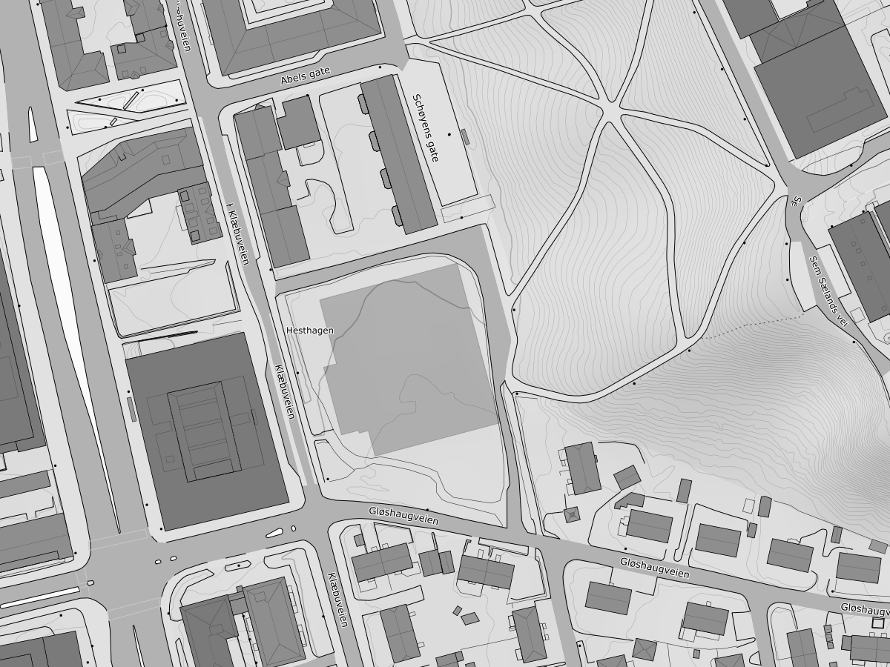

<!-- _class: title title-photo -->
<!-- _header: '24.09.2026' -->
<!-- paginate: false -->

# Mer brukt, men mindre nøyaktig

### Jenter i AI

---

# Fra indøk til Autodesk

Konsulent

- Ny kunde, ny kodebase, ofte
- Leverer, og går videre
- Bredde: mange bransjer, mange stacker

  

  Vilde

Det som overførte seg — og det som måtte læres på nytt: <em>…</em>

<!-- Say: la Vilde fortelle selv — 2 min. Poenget for publikum: det finnes flere veier inn. -->
<!-- TODO ~2:00 -->

---

<!-- paginate: true -->

# Fra fysmat til Autodesk

- Fysiker som ble programmerer
- Jobber med *…* i Forma hos Autodesk
- Kort om veien hit

  

  Sunniva

<!-- Say: kort og personlig — 1 min, ikke mer. -->

---

<!-- _class: section -->

# Regulering av Hesthaugen

---

# Hesthagen — fra parkering til byggeplass

Tomta

- Nedlagt NTNU-parkering mellom Klæbuveien og Gløshaugen
- Detaljregulert av Trondheim kommune (R20200034)
- …

Kilder 
Trondheim kommune, <a href="https://www.trondheim.kommune.no/aktuelt/kunngjoring-arealplan/arkiv-vedtatte-planer/eldre/20232/Hesthagen-og-del-av-Hogskoleparken-gnr-bnr-405-39-405-177-405-101-mfl-detaljregulering-r20200032/">vedtatt detaljregulering</a> og <a href="https://www.trondheim.kommune.no/globalassets/10-bilder-og-filer-eksternt/10-byutvikling/byplankontoret/1c_vedtatt-plan/2023/campus_hesthagen-og-del-av-hogskoleparken-gnrbnr-40539-405177-405101-m.fl.-detaljregulering--r20200034/planbeskrivelse.pdf">planbeskrivelse (PDF)</a> 
Adresseavisen, <a href="https://www.adressa.no/nyheter/trondheim/i/3MOkAP/naa-starter-det-enorme-byggeprosjektet-i-trondheim">«Nå starter det enorme byggeprosjektet i Trondheim»</a>

Figur Hesthagen, mellom Klæbuveien og Gløshaugen. Kart: © <a href="https://www.kartverket.no/">Kartverket</a>, CC BY 4.0.

---

<!-- _class: statement -->

# En påstand som fortjener hele sliden

---

# En likning, om det trengs

$$
E = \int_{\Omega} L(\omega)\,\cos\theta\,\mathrm{d}\omega
$$

<!-- KaTeX er slått på i frontmatter (math: katex). -->

---

<!-- _class: section -->

# Del 2

## …

---

<!-- _class: section -->

# Del 3

## …

---

# Hva nå?

Kom i gang

- Ressurs 1 — …
- Ressurs 2 — …

Ta kontakt

- …

