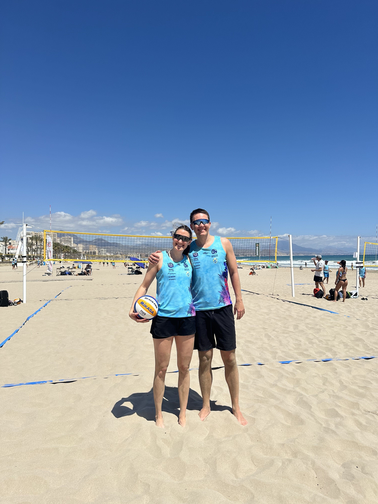
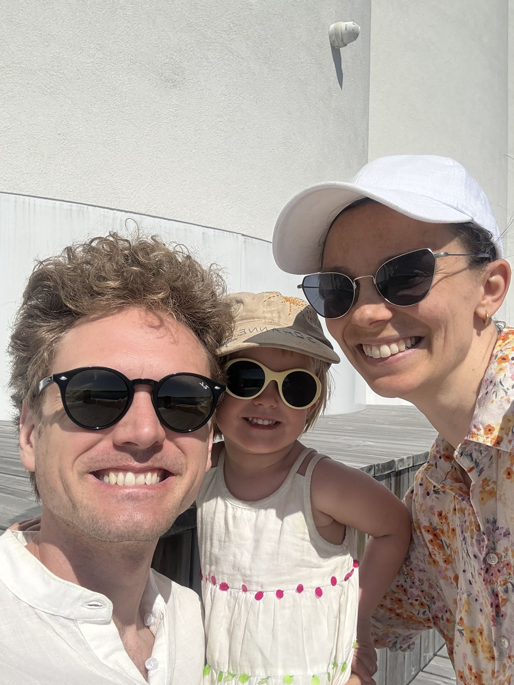
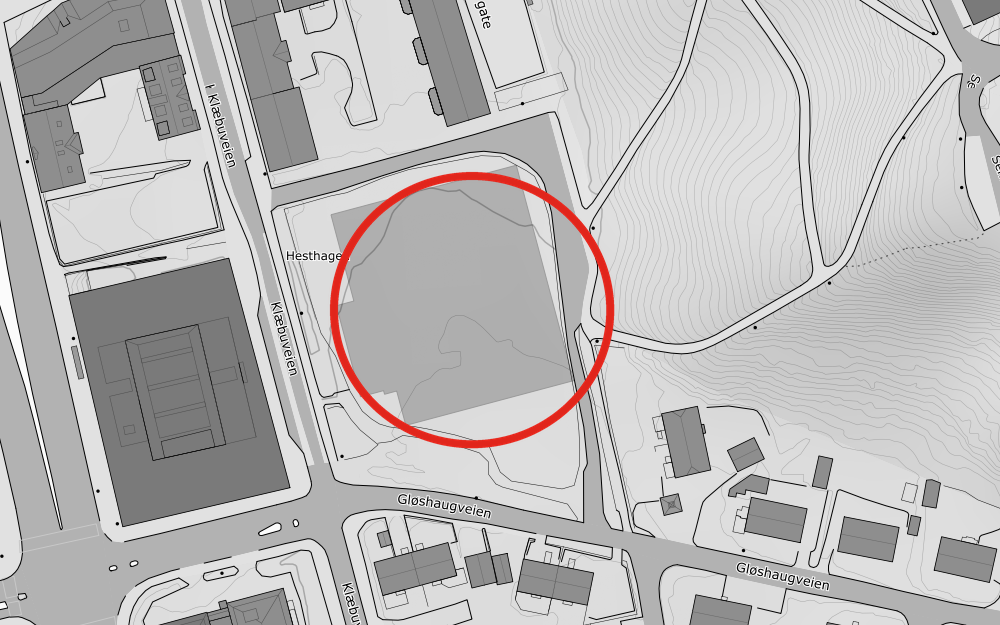
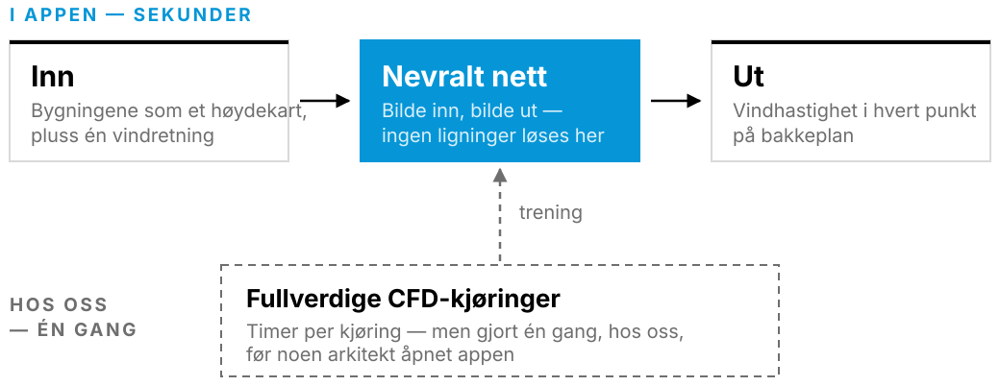

<!-- _class: title title-photo -->
<!-- _header: '24.09.2026' -->
<!-- paginate: false -->

# AI i Autodesk

## Jenter i AI

<!-- Say: les tittelen høyt. «Det høres ut som en innrømmelse. Det er en
     designbeslutning, og vi skal vise dere hvorfor.» -->
<!-- TODO ~0:20 -->

---

<!-- paginate: true -->

# Fra indøk til Autodesk

Vilde

- Internship som utvikler under studiene
- Gøy å bygge produkt i stedet for slides
- Jobbe i en produktorganisasjon

  

  

Jobbe for en mer bærekraftig verden med koding og matte.</em>

<!-- Say: la Vilde fortelle selv. Poenget for publikum: det finnes flere veier inn,
     og «jeg gikk ikke datateknikk» er ikke en sperre. -->
<!-- TODO ~1:20 -->

---

# Jente i Autodesk

Sunniva

- **Fysmat på NTNU**, så forskning: numerikk — å gjøre ligninger om til kode
- Da: Skrev et paper som kanskje fem mennesker i verden har lest
- Nå: også ligniner i et verktøy tusenvis av arkitekter åpner hver dag

  

  

Samme type jobb, men høyere påvirking "i den virkelige verden"

tittel? 

---

<!-- _class: demo -->

<!--
«What is Forma Site Design» fra YouTube. Marp trenger --html=true for at
<iframe> skal rendres; det ligger allerede i kommandoen i README.

Embedden krever nett i salen, og den fungerer ikke i PDF-eksport. Last ned en
lokal kopi som reserve og bytt iframe-en (og skriptet) mot:
  <video src="figures/video/forma-demo.mp4" controls muted playsinline></video>
CSS-en i theme.css håndterer begge.

start=14 og end=74: klippet går fra 0:14 til 1:14 — 60 sekunder, spilt i vanlig
hastighet. Bruker du den lokale reservefila i stedet, blir det #t=14,74 på
slutten av src.

Hvorfor 14 og ikke 18: tittelkortet ligger over de første 5 sekundene, så de
fem første sekundene av klippet ser ingen. Starter vi på 0:14, er videoen kommet
til 0:19 når kortet er borte, og det er der klippet skal begynne for publikum.

rel=0 og modestbranding=1 demper YouTubes egne forslag. autoplay=1 krever
mute=1 — nettlesere blokkerer autoplay med lyd. Lyden skal av uansett.

controls=0 ligger BARE på data-autoplay-src: det er den som spilles i salen, og
uten den blinker YouTubes store play-knapp og kontrollinjen gjennom tittelkortet
(som er halvgjennomsiktig) i det videoen starter. Prisen er at du ikke kan pause
midt i klippet — gå videre til neste slide i stedet. src beholder kontrollene,
så reserveløsningen (og PDF-eksport, der skriptet ikke kjører) fortsatt har en
play-knapp å trykke på.

Tittelkortet «Autodesk Forma» ligger over videoen de første 5 sekundene og fader
ut. Teksten står i .demo-intro-diven under, utseendet i theme.css, og tidene i
setTimeout-en i skriptet. Kortet er helt dekkende hele tiden det ligger der, så
verken YouTubes spinner eller kontrollinjen synes gjennom mens videoen laster.

cc_load_policy=0 og iv_load_policy=3 ber om ingen undertekster og ingen
annotasjoner. cc_load_policy er bare et hint — er undertekster slått på i din
egen YouTube-konto vinner den, så sjekk CC-knappen i spilleren før du går på.
-->

<iframe
  id="forma-demo"
  src="https://www.youtube-nocookie.com/embed/1ovhhMWpohw?start=14&end=74&rel=0&modestbranding=1&playsinline=1&cc_load_policy=0&iv_load_policy=3"
  data-autoplay-src="https://www.youtube-nocookie.com/embed/1ovhhMWpohw?start=14&end=74&rel=0&modestbranding=1&playsinline=1&cc_load_policy=0&iv_load_policy=3&autoplay=1&mute=1&controls=0"
  title="What is Forma Site Design"
  allow="autoplay; encrypted-media; picture-in-picture; fullscreen"
  referrerpolicy="strict-origin-when-cross-origin"></iframe>

  

<!-- Say: 60 sekunder klipp. Ikke snakk over hele — la den rulle, og kommenter
     bare det som skjer på slutten. -->
<!-- TODO ~1:00 -->

---

# Tidligfase: alt er åpent, ingenting er tegnet

Arkitekten lurer på

- Hvor mange kvadratmeter får jeg plass til her?
- Hvor skal bygget stå, og hvor høyt kan det bli?
- Blir det bra her — sol, lys, luft, lyd?

Utbyggeren lurer på

- Går regnestykket opp?
- Hva må vi dokumentere for kommunen?
- Hva koster det å ombestemme seg om tre måneder?

Noen få uker der nesten alt avgjøres.

<!-- Say: dette er rammen for hele resten av talken. Alt vi bygger, bygges for
     disse ukene. -->
<!-- TODO ~0:45 -->

---

# Analyser i Autodesk Forma

Støy

Solenergi

Dagslys

Mikroklima

Sol

Vind

Alle seks kjørt på samme tomt: hovedbygget på Gløshaugen.

<!-- Say: seks analyser, samme modell, samme ettermiddag. Pek på vind — «den ene
     nederst til høyre er den vi skal snakke om resten av tiden.» -->
<!-- TODO ~0:50 -->

---

# Vindkomfort

Figur Komfortkart for vind, hovedbygget på Gløshaugen. Egen Forma-analyse.

Komfortskalaen — Lawson LDDC

<!--
FARGER OG NAVN ER HENTET FRA KODEN, ikke funnet på:

  wind-analysis-ui/src/analysis/surfaceResult/windColors.ts:15
      comfortColors = ["#B2F8DA","#55DCA2","#FED52A","#FFA900","#FF463A"]
  wind-analysis-ui/src/i18n/translations/nb-NO/texts.json
      comfort.labels = Sitte / Stå / Rusle / Gå / Ukomfortabelt
  wind-surrogate/wind/lib/comfort.py:77
      lawson_lddc: speed_thresholds [2.5, 4, 6, 8] m/s, 5 % for alle fire
  wind-surrogate/wind/lib/comfort.py:130-152
      compute_comfort(): klasse 0-4, én klasse per terskel som overskrides

Fem kategorier, ikke fire — klasse 0 er den roligste og har ingen terskel.
Samme palett i både CFD-appen og ML-webkomponenten.
-->
<ul class="scale">
<li><b>Sitte</b>Under 2,5 m/s nesten hele året</li>
<li><b>Stå</b>Over 2,5 m/s mer enn 5 % av tiden</li>
<li><b>Rusle</b>Over 4 m/s mer enn 5 % av tiden</li>
<li><b>Gå</b>Over 6 m/s mer enn 5 % av tiden</li>
<li><b>Ukomfortabelt</b>Over 8 m/s mer enn 5 % av tiden</li>
</ul>

Bygge overgang til neste slide

<!-- Say: pek på de oransje flekkene ved bygningshjørnene. Det er der vinden
     akselererer — og der arkitekten hadde tenkt en benk. -->
<!-- TODO ~1:10 -->

---

<!-- _class: section -->

# Regulering av Hesthagen
## Case
<!-- TODO ~0:10 -->

---
# Hesthagen — fra parkeringsplass til bygg

Tomta og planen

- Brukt som NTNU-parkering mellom Klæbuveien og Gløshaugen
- En del av **NTNUs samlokaliseringstrategi**
- Fem etasjers hus der bilene står i dag
- Torg, trapp, gangbru og en offentlig plass rundt bygget

<!--
BRUK -ring-fila her, ikke hesthagen-kart.png. Den røde ringen rundt tomta er
brent inn i derivatfila; kildekartet har ingen ring. Marp klarte ikke å legge
ringen på i inline SVG (hver slide rendres inne i sin egen <svg>, og en nøstet
SVG med ekstern <image> falt ut av eksporten), så den ligger i PNG-en.

Skal ringen flyttes: skriptet står i README under «Kartet med ring».
-->

Figur Hesthagen, mellom Klæbuveien og Gløshaugen. Rød ring: tomta som reguleres. Kart: © <a href="https://www.kartverket.no/">Kartverket</a>, CC BY 4.0.

Mye av det planen lover, er uterom.

<!-- Say: «dette er tomta, og halve salen har parkert der.» Gjør det lokalt før
     du gjør det teknisk, og les callouten sakte — det er svingen inn til
     vindanalysen.

     Detaljregulering r20200032, vedtatt av bystyret 2. mars 2023. Kildene lå på
     sliden før, men 0,58em på projektor leser ingen — ta dem muntlig om noen
     spør:
       https://www.trondheim.kommune.no/aktuelt/kunngjoring-arealplan/arkiv-vedtatte-planer/eldre/20232/Hesthagen-og-del-av-Hogskoleparken-gnr-bnr-405-39-405-177-405-101-mfl-detaljregulering-r20200032/
       https://www.adressa.no/nyheter/trondheim/i/3MOkAP/naa-starter-det-enorme-byggeprosjektet-i-trondheim
-->
<!--
FIGUR: sliden tåler en massevolum-render i stedet for kartet. Lag den i Forma fra
reguleringskartet og eksporter selv — IKKE klipp ut illustrasjonene fra
planbeskrivelsen. De er forslagsstillerens, og repoet er offentlig (se «Ikke
bruk» i README).
-->
<!-- TODO ~0:50 -->

---
# Fysikkmodellen

<!--
LIGNINGEN ER VERIFISERT MOT KODEN i spacemakerai/wind-analysis-backend:

  openfoam/UEqn.H          fvm::div(phi, U) + turbulence->divDevReff(U)
                           == -fvc::grad(p), pluss
                           fvm::Sp(0.2*leafAreaDensity*mag(U), U)
  openfoam/createFields.H  leser inn feltet leafAreaDensity
  openfoam/realizableKE.*  patchet realizable k–epsilon (Shih et al. 1995)
  openfoam/Dockerfile.openfoam  OpenFOAM v2306, solver simpleFoam
  README.md:87             «simpleFoam with custom realizableKE turbulence model»

Tre ting den forrige ligningen tok feil:
  1. Den hadde du/dt. simpleFoam har ingen ddt-term — vi løser det STASJONÆRE
     problemet, altså den ferdig utblåste tilstanden, ikke forløpet dit.
  2. Den hadde bare molekylær viskositet nu. Vi løser de REYNOLDS-MIDLEDE
     ligningene, der nu erstattes av nu + nu_t og nu_t kommer fra k–epsilon.
  3. Den manglet vegetasjonsleddet, som er vår egen endring av solveren.

c_d = 0,2 er hardkodet i UEqn.H, a er leafAreaDensity (bladarealtetthet).
Vil du droppe trærne fra sliden, er det ett \underbrace å slette.
-->
$$
\begin{aligned}
\underbrace{(\mathbf{U}\cdot\nabla)\mathbf{U}}_{\text{vinden flytter seg selv}}
\;&=\; -\nabla p
\;+\; \underbrace{\nabla\cdot\big[(\nu+\nu_t)\big(\nabla\mathbf{U}+\nabla\mathbf{U}^{\top}\big)\big]}_{\text{friksjon og turbulens}}
\;-\; \underbrace{c_d\,a\,\lvert\mathbf{U}\rvert\,\mathbf{U}}_{\text{trær}} \\[0.4em]
\nabla\cdot\mathbf{U} \;&=\; 0
\end{aligned}
$$

<strong>Reynolds-midlede Navier–Stokes-ligninger</strong> — stasjonære og inkompressible lukket med <strong>realizable k–ε</strong> · løst i OpenFOAM med <code>simpleFoam</code>

Hva som står der

- $\mathbf{U}$ — den **tidsmidlede** vinden, ikke vindkast
- Newtons andre lov for en luftpakke, pluss: luft blir ikke borte
- Ingen formel gir svaret — det må regnes ut, punkt for punkt. Det er dette «numerikk» betyr

Derfor tar det tid

- Del tomta i celler: millioner av dem for et bykvartal
- Løs ligningene i hver celle, om og om igjen, til svaret står stille
- Gjenta for hver vindretning, og vekt med vindstatistikken for stedet

gøy med matte eller stack overflow?

<!-- Say: ikke gå gjennom ligningen ledd for ledd. Poenget er ett: den kan ikke
     løses, bare regnes — og det er ikke koden som er treg, det er problemet.
     Flere celler og flere retninger er den eneste veien til et bedre svar.

     Har du 20 sekunder til overs: siste ledd er vår egen endring av solveren.
     Trær er ikke vegger — de bremser vinden i forhold til hvor tett bladverket
     er (a = bladarealtetthet), og c_d = 0,2. Det er en fin illustrasjon av at
     «fysikkmodellen» ikke er noe man laster ned ferdig. -->
<!-- TODO ~1:20 -->

---

# Surrogatmodellen

<!--
FIGUREN ER VERIFISERT MOT KODEN i spacemakerai/wind-surrogate. Det viktigste
funnet: vindretningen er IKKE en inngang til nettet. Geometrien roteres i
stedet, og for komfort kjøres alle åtte retninger som én batch:

  lib/prediction.py:53-61   predict(): rotate(-direction) → nett → rotate(+direction)
  lib/prediction.py:64-86   predict_comfort(): åtte rotasjoner i én batch,
                            deretter vektet med vindrosen
  lib/constants.py:35       WIND_DIRECTIONS = [0,45,...,315]
  lib/constants.py:37       GROUND_MEASUREMENT_HEIGHT = 1.75 m
  lib/constants.py:22-31    200x200 px site i 500x500 px kontekst, 1,5 m/px
  lib/utils/model.py        ONNX Runtime, assets/latest.onnx
  lambdas/handler_trigger_data_generation.py
                            treningsdata hentes løpende fra SUCCEEDED-analyser
                            i wind-analysis-backend-prod

Detaljene står i SVG-filens egen header, og manuset i Say-kommentaren nederst.
(Ikke skriv en HTML-kommentar inni denne: den ytre slutter ved det første
sluttmerket, og resten lekker ut som brødtekst.)
-->

Modellen har sett så mange løsninger at den kjenner igjen svaret.

Gir skissen mening?

<!-- Say: rammen som gjør det forståelig for en AI-sal: det er bilde-til-bilde.
     Inn: terreng og bygninger som høydekart. Ut: et hastighetsfelt.

     De to poengene som er verdt tiden:

     1. Nettet vet ikke hva en vindretning er. Vi ROTERER geometrien i stedet,
        kjører nettet, og roterer svaret tilbake. Åtte retninger blir åtte
        rotasjoner i én batch. Samme oppskrift som CFD-en — «gjenta for hver
        retning, vekt med vindrosen» — men åtte nettverkskjøringer i stedet for
        åtte timelange simuleringer.

     2. Treningsdataene er kundenes egne CFD-analyser. En lambda plukker opp
        ferdige kjøringer fra produksjon og gjør dem til treningseksempler. Hver
        gang noen betaler for den dyre analysen, blir den et eksempel til den
        raske. Det er derfor det er treningsdataene, ikke nettverket, som er
        arbeidet. -->
<!-- TODO ~1:05 -->

---

# To vindmodeller

<h3>Fullverdig CFD</h3>

- Nøyaktig, og etterprøvbar
- Timer per kjøring
- Kjøres én gang, til slutt
- **Dokumenterer** et valg som alt er tatt

<h3>Surrogatmodellen</h3>

- Omtrentlig, med et avvik vi måler
- Sekunder per kjøring
- Kjøres hele tiden, mens man tegner
- **Tar** valget, sammen med arkitekten

  
Surrogatmodellen gir arkitekten mulighet til å teste mange alternativer — mens det ennå går an å endre dem.

<!-- Say: gå gjennom kortene raskt, kolonne mot kolonne, ikke punkt for punkt.
     Viktig nyanse: vi erstatter ikke CFD, vi flytter den bakover i prosessen.
     Vær ærlig om avviket hvis noen spør; ikke selg det som gratis.

     Så pause, snu deg mot punchlinja og si den — dette er betalingen for
     tittelen. Hold pausen etterpå, selv om sliden ikke lenger er tom. -->
<!-- TODO ~0:55 -->

---

# Vi står på stand

  

  Vilde

  

  Sunniva

<!-- TODO: legg inn figures/people/elizabeth.jpg -->

  

  Elizabeth

<!-- TODO: legg inn figures/people/guro.jpg -->

  

  Guro

## Kom og spør oss om alt vi ikke fikk plass til her!

Portretter av Elizabeth og Guro mangler

<!-- TODO ~0:20 -->
