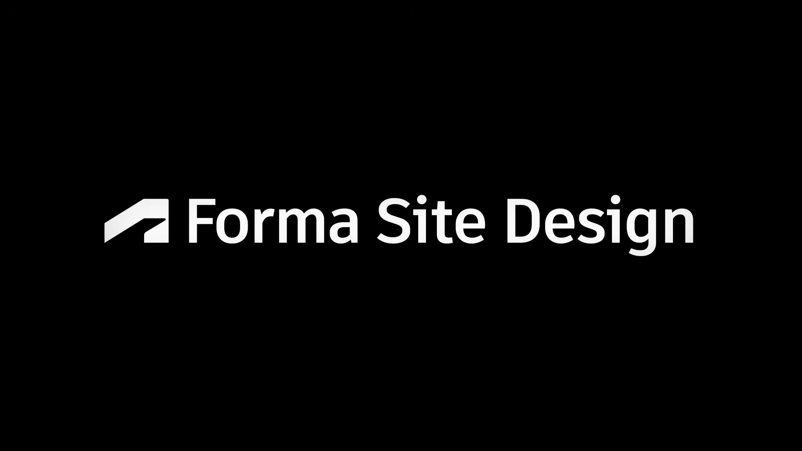
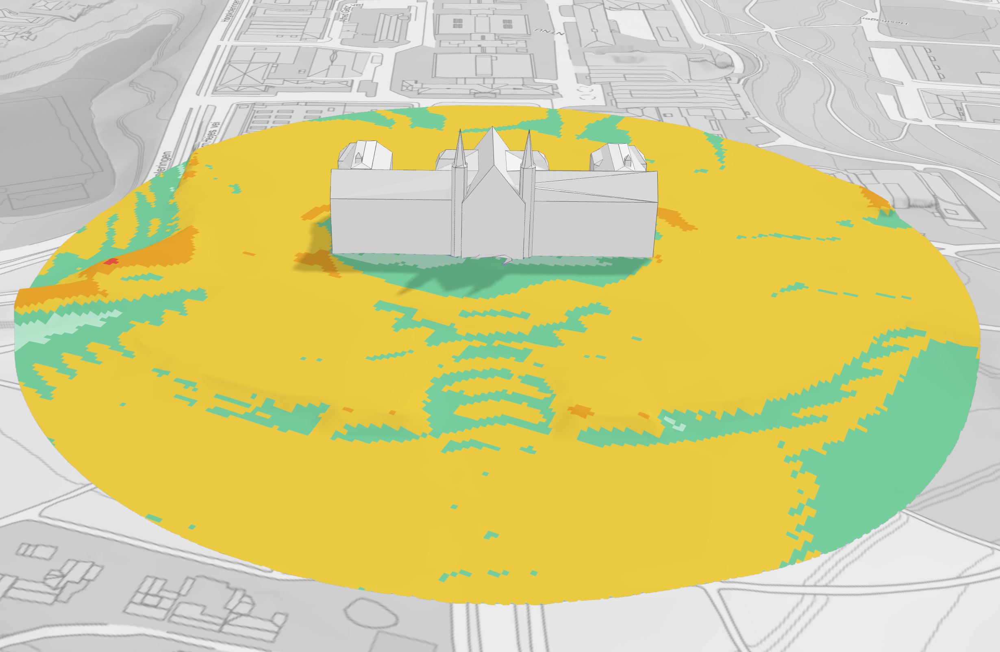
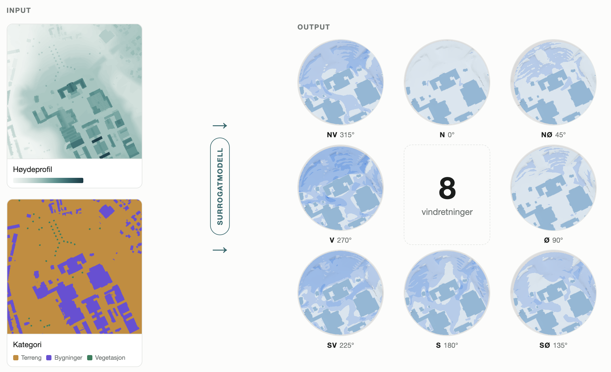

<!-- _class: title title-photo -->
<!-- _header: '24.09.2026' -->
<!-- paginate: false -->

# Jenter i AI

---

<!-- paginate: true -->

# Jenter i Autodesk

  

    

    

  

  
Vilde

  

    

    

  

  
Sunniva

<!--
TATT VARE PÅ: kulepunktene og callout-ene som sto på de to gamle slidene.
Ikke slettet, fordi de er ekte innhold — men de står ikke på sliden nå, og
skal fortelles muntlig i stedet. Vil du ha dem tilbake på flata, er de her:

  Vilde
  - Fra indøk til Autodesk
  - Internship som utvikler under studiene
  - Gøy å bygge produkt i stedet for slides
  - Jobbe i en produktorganisasjon
  callout: Jobbe for en mer bærekraftig verden med koding og matte.

  Sunniva
  - fra Fysmat til Autodesk — å gjøre ligninger om til kode
  - Da: skrev et paper som kanskje fem mennesker i verden har lest
  - Nå: også ligninger i et verktøy tusenvis av arkitekter åpner hver dag
  callout: Samme type jobb, men høyere påvirkning i den virkelige verden.
-->

<!-- Say: la hver av dere fortelle selv, kort. Poenget for publikum er at det
     finnes flere veier inn — indøk og Fysmat, ikke datateknikk — og at «jeg
     gikk ikke datateknikk» ikke er en sperre. Punktene står ikke på sliden
     lenger, så de må sies. -->
<!-- TODO ~1:40 -->

---

<!-- _class: demo overlay -->

<!-- Hesthagen-parkeringen, ikke Filipstad. Bildet sto før på et skjermbilde fra
     demofilmen — en tomt i Oslo, med hele Forma-grensesnittet rundt. Det sa
     «programvare» på en slide som skal si «tomt». Nå er det stedet selv: en
     parkeringsplass full av biler, der halve salen har stått.

     Flyfoto fra 2022, siste årgang før anlegget startet. Rød strek er
     tomtegrensa fra OpenStreetMap, ikke tegnet på frihånd.

     Denne sliden bruker -lys-utgaven: hele flata er like lys, så man ser
     nabolaget rundt like godt som parkeringsplassen. Sliden skal vise STEDET.
     Slide 4 og 5 bruker den dempede, der blikket skal ligge på tomta og
     boblene. Bildet skifter altså her — det leser som at lyset dempes og
     rollene trer fram.

     Bildet lages av tools/hesthagen_slide4.py, varianten «flyfoto». Den har
     sin egen ramme (ROLLER i skriptet) der tomta ligger til høyre og litt opp
     — nettopp for at snakkeboblene på de to neste slidene skal få plass til
     venstre uten å dekke den røde streken.

     Slide 4, 5 og 6 deler dette bildet. Det skal IKKE bytte når arkitekten og
     utbyggeren kommer inn; det er oppbyggingen som er poenget. -->

  
Tidligfase

  <h1>Kunsten å fylle opp en tomt</h1>

  Flyfoto 2022 © Geovekst / Trondheim kommune · Kart © Kartverket, CC BY 4.0

<!-- Say: la bildet stå et øyeblikk før du sier noe. Tomt kvartal, biler der
     halve salen har parkert, ingen streker. Så: «og her begynner spørsmålene.» -->
<!-- TODO ~0:20 -->

---

<!-- _class: demo overlay -->

<!-- Steg 2 av tre på samme bilde: arkitekten kommer inn. Bildet skal IKKE
     bytte — det er oppbyggingen som er poenget, ikke tre forskjellige bilder.

     roles-holder «venstre» klemmer rollene inn i venstre halvdel, så boblene
     ikke legger seg over tomta. Arkitekten står i samme spalte her som på
     neste slide, så figuren ikke hopper når du klikker. -->

  Flyfoto 2022 © Geovekst / Trondheim kommune · Kart © Kartverket, CC BY 4.0

<ul>
<li>Hvor skal bygget stå, og hvor høyt kan det bli?</li>
<li>Blir det bra her (lys, støy, vind)?</li>
</ul>

Arkitekten

<!-- Say: «først kommer arkitekten.» Les de tre spørsmålene, ikke ordrett — de
     står der for publikum, ikke for deg. -->
<!-- TODO ~0:20 -->

---

<!-- _class: demo overlay -->

<!-- Steg 3: utbyggeren kommer inn ved siden av, i høyre spalte av samme
     venstrestilte bærer. -->

  Flyfoto 2022 © Geovekst / Trondheim kommune · Kart © Kartverket, CC BY 4.0

<ul>
<li>Hvor skal bygget stå, og hvor høyt kan det bli?</li>
<li>Blir det bra her (lys, støy, vind)?</li>
</ul>

Arkitekten

<ul>
<li>Går regnestykket opp?</li>
<li>Hva koster det å ombestemme seg om tre måneder?</li>
</ul>

Utbyggeren

<!-- Say: «og så kommer den som betaler.» Arkitekten spør om form, utbyggeren om
     risiko — begge trenger svar før noe er tegnet ferdig. Punchlinja «noen få
     uker der nesten alt avgjøres» sier du her, i stedet for å vise den. -->
<!-- TODO ~0:25 -->

---

<!-- _class: demo overlay logo-card -->

<!-- Logokortet fra filmen (1 s). Det rammer inn Forma-delen: ett foran videoen,
     ett etter vind- og AI-bildene. Marp-klassen logo-card skjuler vår egen
     Autodesk-logo nederst til venstre, siden kortet alt har en midt i bildet. -->

<!-- Say: ikke stå her. Klikk videre med én gang — kortet er en sceneanvisning,
     ikke en slide. -->
<!-- TODO ~0:05 -->

---

<!-- _class: demo flipbook on-dark eget-merke -->

<!-- Fire slides erstatter de sju flipbook-bildene fra demofilmen. Grunnen er
     oppløsning: de gamle var hentet ut av en 1080p-video, tre på 1920 px og
     fem beskåret til 1344. Disse er skjermbilder rett fra Forma, nedskalert
     til 2560 px — 2x slideflata, altså deckets standard for fullflate-bilder.
     Originalene på 3456 px ligger i site-design/original/.

     on-dark her og ikke på de tre neste: bakgrunnen er verdensrommet, altså
     svart nede til venstre, og da må Autodesk-logoen og sidetallet være hvite.
     De tre andre har Formas lyse sidepanel i det hjørnet. -->

Kontekst

Velg geolokasjon

---

<!-- _class: demo flipbook eget-merke -->

Kontekst

Bestill data

---

<!-- _class: demo flipbook eget-merke -->

Sett kontekst

Jobb i nettleseren

---

<!-- _class: demo flipbook eget-merke -->

Utforsk

Begynn å utforske din tomt

---

<!-- _class: demo flipbook eget-merke -->

Tegn

Iterer over forslaget

---

# Analyser i Autodesk Forma

  

    
    
  

Støy

Solenergi

Dagslys

Mikroklima

Sol

Vind

<!-- Say: seks analyser, samme modell, samme ettermiddag. La dem se bredden
     her — ikke pek på noen enkelt ennå. Neste slide er den samme, med vind
     markert, og da tar du valget for dem. -->
<!-- TODO ~0:40 -->

---

# Analyser i Autodesk Forma

  

    
    
  

Støy

Solenergi

Dagslys

Mikroklima

Sol

Vind

<!-- Say: «og det er denne ene vi skal bruke resten av tiden på.» Hold på
     rammen et øyeblikk før du går videre — det er her vindfortellingen
     begynner. Ikke forklar hvorfor vind ennå; det kommer på neste slide. -->
<!-- TODO ~0:15 -->

---

<!-- _class: result-build -->

# Fra vind: komfortabelhet

  

    
Komfortskalaen — Lawson LDDC

    

      
<b>Sitte</b>under 2,5 m/s

      
<b>Stå</b>over 2,5 m/s

      
<b>Rusle</b>over 4 m/s

      
<b>Gå</b>over 6 m/s

      
<b>Ukomf.</b>over 8 m/s

    

  

  
  
Komfortkart for vind, hovedbygget på Gløshaugen.

<!-- Say: dette er svaret arkitekten ser. Ingen modell, ingen ligning — bare
     resultatet, og fargene som sier hva det betyr. La det stå litt.
     De to neste slidene legger på hvor svaret kommer fra. -->
<!-- TODO ~0:30 -->

---

<!-- _class: result-build -->

# Fra vind: komfortabelhet

  
  
Fysikkmodellen

$$
\begin{aligned}
(\mathbf{U}\cdot\nabla)\mathbf{U} \;=\;& -\nabla p \\
&+\; \nabla\cdot\big[(\nu+\nu_t)\big(\nabla\mathbf{U}+\nabla\mathbf{U}^{\top}\big)\big] \\
&-\; c_d\,a\,\lvert\mathbf{U}\rvert\,\mathbf{U} \\[0.3em]
\nabla\cdot\mathbf{U} \;=\;& \;0
\end{aligned}
$$

  
Timer per iterasjon.

  

    
Komfortskalaen — Lawson LDDC

    

      
<b>Sitte</b>under 2,5 m/s

      
<b>Stå</b>over 2,5 m/s

      
<b>Rusle</b>over 4 m/s

      
<b>Gå</b>over 6 m/s

      
<b>Ukomf.</b>over 8 m/s

    

  

  
  
Komfortkart for vind, hovedbygget på Gløshaugen.

<!-- Say: «dette er hvordan vi FAKTISK regner det ut.» Ligningen er den
     stasjonære RANS-en simpleFoam løser, med vårt eget vegetasjonsledd. Ikke gå
     gjennom leddene her — den annoterte versjonen kommer på Fysikkmodell-sliden.
     Poenget nå er bare: timer. -->
<!-- TODO ~0:25 -->

---

<!-- _class: result-build -->

# Fra vind: komfortabelhet

  
  
Fysikkmodellen

$$
\begin{aligned}
(\mathbf{U}\cdot\nabla)\mathbf{U} \;=\;& -\nabla p \\
&+\; \nabla\cdot\big[(\nu+\nu_t)\big(\nabla\mathbf{U}+\nabla\mathbf{U}^{\top}\big)\big] \\
&-\; c_d\,a\,\lvert\mathbf{U}\rvert\,\mathbf{U} \\[0.3em]
\nabla\cdot\mathbf{U} \;=\;& \;0
\end{aligned}
$$

  
Timer per iterasjon.

  

    
Komfortskalaen — Lawson LDDC

    

      
<b>Sitte</b>under 2,5 m/s

      
<b>Stå</b>over 2,5 m/s

      
<b>Rusle</b>over 4 m/s

      
<b>Gå</b>over 6 m/s

      
<b>Ukomf.</b>over 8 m/s

    

  

  
  
Komfortkart for vind, hovedbygget på Gløshaugen.

  
  
Surrogatmodellen

  
Nevralt nett, trent på ferdige fysikkmodell-kjøringer.

  
Sekunder per iterasjon.

<!-- Say: «og dette er den andre veien til det samme bildet.» Begge pilene
     peker inn mot samme kart — det er hele argumentet. Så: timer mot sekunder,
     og hvorfor det avgjør hvem som kan bruke modellen. -->
<!-- TODO ~0:30 -->

---

# To modeller, ett svar

Begge svarer på det samme spørsmålet — hvordan vinden oppfører seg mellom byggene. Forskjellen er hvor nøyaktig svaret blir, og hvor lenge du må vente på det.

  

    
    <h3>Fullverdig CFD</h3>
  

  
Timerper kjøring

  <ul>
    <li>Nøyaktig, og etterprøvbar</li>
    <li>Kjøres én gang, til slutt</li>
    <li><b>Dokumenterer</b> et valg som alt er tatt</li>
  </ul>

  

    
Komfortskalaen — Lawson LDDC

    

      
<b>Sitte</b>under 2,5 m/s

      
<b>Stå</b>over 2,5 m/s

      
<b>Rusle</b>over 4 m/s

      
<b>Gå</b>over 6 m/s

      
<b>Ukomf.</b>over 8 m/s

    

  

  
  
Samme komfortkart — uansett hvilken av dem som regnet det ut.

  

    
    <h3>Surrogatmodellen</h3>
  

  
Sekunderper kjøring

  <ul>
    <li>Omtrentlig, med et avvik vi måler</li>
    <li>Kjøres hele tiden, mens man tegner</li>
    <li><b>Tar</b> valget, sammen med arkitekten</li>
  </ul>

<!-- Say: les inngangslinja først — den gjør at de to sidene leses som to
     nøyaktighetsnivåer for samme svar, og ikke som to ulike verktøy.
     Pek så på «Timer» mot «Sekunder». Det er den forskjellen som avgjør hvem
     som kan bruke modellen, og når. Kartet i midten er beviset på at de svarer
     på det samme. -->
<!-- TODO ~0:45 -->

---

# Surrogatmodellen

<!--
FIGUREN ER VERIFISERT MOT KODEN i spacemakerai/wind-surrogate. Det viktigste
funnet: vindretningen er IKKE en inngang til nettet. Geometrien roteres i
stedet, og for komfort kjøres alle åtte retninger som én batch:

  lib/prediction.py:53-61   predict(): rotate(-direction) → nett → rotate(+direction)
  lib/prediction.py:64-86   predict_comfort(): åtte rotasjoner i én batch,
                            deretter vektet med vindrosen
  lib/constants.py:35       WIND_DIRECTIONS = [0,45,...,315]
  lib/constants.py:37       GROUND_MEASUREMENT_HEIGHT = 1.75 m
  lib/constants.py:22-31    200x200 px site i 500x500 px kontekst, 1,5 m/px
  lib/utils/model.py        ONNX Runtime, assets/latest.onnx
  lambdas/handler_trigger_data_generation.py
                            treningsdata hentes løpende fra SUCCEEDED-analyser
                            i wind-analysis-backend-prod

Detaljene står i SVG-filens egen header, og manuset i Say-kommentaren nederst.
(Ikke skriv en HTML-kommentar inni denne: den ytre slutter ved det første
sluttmerket, og resten lekker ut som brødtekst.)
-->

Modellen har sett så mange løsninger at den kjenner igjen svaret.

Gir skissen mening?

<!-- Say: rammen som gjør det forståelig for en AI-sal: det er bilde-til-bilde.
     Inn: terreng og bygninger som høydekart. Ut: et hastighetsfelt.

     De to poengene som er verdt tiden:

     1. Nettet vet ikke hva en vindretning er. Vi ROTERER geometrien i stedet,
        kjører nettet, og roterer svaret tilbake. Åtte retninger blir åtte
        rotasjoner i én batch. Samme oppskrift som CFD-en — «gjenta for hver
        retning, vekt med vindrosen» — men åtte nettverkskjøringer i stedet for
        åtte timelange simuleringer.

     2. Treningsdataene er kundenes egne CFD-analyser. En lambda plukker opp
        ferdige kjøringer fra produksjon og gjør dem til treningseksempler. Hver
        gang noen betaler for den dyre analysen, blir den et eksempel til den
        raske. Det er derfor det er treningsdataene, ikke nettverket, som er
        arbeidet. -->
<!-- TODO ~1:05 -->

---

<!-- Say: den konkrete versjonen av skissen på forrige slide. Pek på de to
     bildene til venstre: høyden på alt som står der, og hva det er — terreng,
     bygning eller vegetasjon. Det er hele inngangen. Ingen mesh, ingen
     randbetingelser.

     Til høyre: åtte felt, ett per retning. Understrek at det ikke er åtte
     modeller — det er én modell kjørt åtte ganger på rotert geometri, og de
     vektes med vindrosen til det komfortkartet de så på Gløshaugen-sliden.

     Har du tid til overs: 8 retninger x noen sekunder mot 8 x flere timer CFD.
     Det er hele poenget med at den kan stå på mens man tegner. -->
<!-- TODO ~0:40 -->

---

# Den kjører mens du tegner

Opptak fra Hesthagen-modellen i Forma: flytt et volum, og se vindfeltet regne
seg om. Skjermopptak → figures/video/hesthagen-demo.mp4

Mangler opptaket. Ta det opp selv fra Forma på Hesthagen-prosjektet — 10–15
sekunder holder, og det tåler å gå på loop. Legg fila i talk/figures/video/ (den
er gitignorert) og bruk tools/flipbook.sh --shots for å lage PDF-bildene, samme
oppskrift som forma-demo. Se README, «To sett bilder».

<!-- Say: dette er hele poenget, demonstrert. Ikke forklar mens den kjører —
     la dem se at tallet endrer seg i det volumet flyttes. -->
<!-- TODO ~0:40 -->

---

# Vi står på stand

  

  Vilde

  

  Sunniva

<!-- TODO: legg inn figures/people/elizabeth.jpg -->

  

  Elizabeth

<!-- TODO: legg inn figures/people/guro.jpg -->

  

  Guro

## Kom og spør oss om alt vi ikke fikk plass til her!

Portretter av Elizabeth og Guro mangler

<!-- TODO ~0:20 -->
